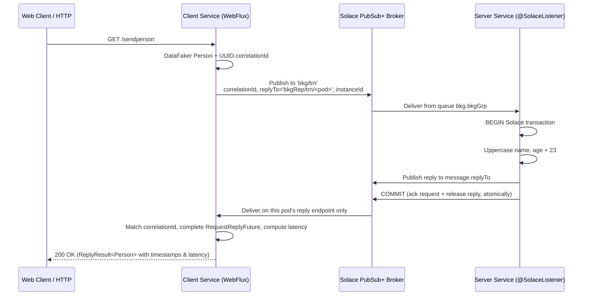

# Solace Request-Reply Microservices

An asynchronous **Request-Reply** implementation over **Solace PubSub+**, built on a small Spring
library that gives Solace the same programming model **[Spring for Apache Kafka](https://spring.io/projects/spring-kafka)**
gives Kafka: `SolaceTemplate`, `ReplyingSolaceTemplate`, `@SolaceListener`, `@EnableSolace`,
listener containers with configurable concurrency, and Spring-managed
[Solace transactions](https://docs.solace.com/Messaging/Guaranteed-Msg/Transactions.htm).

Spring Cloud Stream and the Solace binder (`com.solace.spring.cloud:spring-cloud-starter-stream-solace`)
have been removed; everything now sits directly on **JCSMP** through the
`solace-java-spring-boot-starter`.

---

## 🏗️ Architecture Overview



---

## 🧩 The Solace library (`solace-library`)

Everything lives under `cris.prs.messaging.solace`.

| Spring for Apache Kafka | This library |
| :--- | :--- |
| `@EnableKafka` | `@EnableSolace` |
| `@KafkaListener` | `@SolaceListener` |
| `KafkaTemplate` | `SolaceTemplate` |
| `ReplyingKafkaTemplate` | `ReplyingSolaceTemplate` |
| `ProducerFactory` / `ConsumerFactory` | `SolaceSessionFactory` |
| `ConcurrentKafkaListenerContainerFactory` | `DefaultSolaceListenerContainerFactory` |
| `KafkaListenerEndpointRegistry` | `SolaceListenerEndpointRegistry` |
| `KafkaTransactionManager` | `SolaceTransactionManager` |
| `ConsumerRecord<K,V>` | `SolaceRecord<T>` |
| `ContainerProperties` | `ContainerProperties` |

### Auto-configuration

`SolaceAutoConfiguration` lives in `cris.prs.solace.autoconfigure` — outside the applications'
component scanned `cris.prs.messaging` package, as a starter should — and is registered in
`META-INF/spring/org.springframework.boot.autoconfigure.AutoConfiguration.imports`, running after
the Solace starter's own auto-configuration. Putting `solace-library` on the classpath is enough to
get:

* `SolaceSessionFactory` on top of the starter's `SpringJCSMPFactory`
* `SolaceTemplate` (`solaceTemplate`)
* `ReplyingSolaceTemplate` + its per-instance reply container
* `solaceListenerContainerFactory`
* `SolaceTransactionManager`
* `@SolaceListener` detection — the auto-configuration applies `@EnableSolace` for you, exactly as
  Spring Boot applies `@EnableKafka`. Declare `@EnableSolace` yourself only when auto-configuration
  is switched off.

### Producing

```java
@Autowired SolaceTemplate<Object> solace;

solace.send("bkg/trn", person);
solace.send("bkg/trn", correlationId, person);
solace.send("bkg/trn", person, Map.of("tenant", "north"));   // extra headers become SDT properties
```

### Consuming

```java
@SolaceListener(
        id = "booking",
        queue = "bkg", group = "bkgGrp",          // -> endpoint bkg.bkgGrp
        topics = {"bkg/trn", "bkg/trn/>"},
        concurrency = "10",
        transactional = "true")
public Person booking(Person person,
        @Header(name = SolaceHeaders.CORRELATION_ID, required = false) String correlationId) {
    person.setName(person.getName().toUpperCase());
    person.setAge(person.getAge() + 23);
    return person;                                 // published to the request's replyTo
}
```

Supported parameters: the converted payload, `Message<T>`, `SolaceRecord<T>`, the raw
`BytesXMLMessage`, and `@Payload` / `@Header` / `@Headers`. A non-void return value is published to
the request's `replyTo` (or to `replyDestination` when set on the annotation).

### Request-reply

```java
@Autowired ReplyingSolaceTemplate solace;

RequestReplyFuture<Person> future = solace.sendAndReceive("bkg/trn", person, Person.class);
Person reply = future.get();          // or Mono.fromFuture(future)
long latency = future.getLatency();
```

---

## 🌐 Multi-instance handling: the reply topic carries the pod name

Every instance resolves an **instance id** (`HostnameInstanceIdProvider`) from, in order:

1. `solace.instance-id` if set
2. the `HOSTNAME` environment variable (set by Kubernetes to the pod name)
3. the `POD_NAME` environment variable (declared explicitly in `client/k8s/deployment.yaml`)
4. the local host name, else a random suffix

That id becomes the last level of the reply topic and, for queue based modes, part of the reply
endpoint name:

```
reply topic     bkgRep/trn/client-7d9f4c8b6-xk2mp
reply endpoint  bkgRep.trn.client-7d9f4c8b6-xk2mp
```

Each request carries that topic in its `replyTo` field, so the server replies to the exact pod that
asked. Scaling the client out needs no configuration change, and the old broker side selector
(`hostname = '${HOSTNAME}'`) is gone — routing is now structural rather than filtered.

### Reply endpoint modes

`solace.request-reply.endpoint-mode` (and `solace.listener.endpoint-mode` for `@SolaceListener`
containers) selects the delivery guarantee:

| Mode | Endpoint | Guarantee | Notes |
| :--- | :--- | :--- | :--- |
| `DURABLE_QUEUE` | provisioned, named `<queue>.<group>.<instance-id>` | guaranteed, survives restarts | queues of dead pods need cleanup |
| `NON_DURABLE_QUEUE` *(default for replies)* | temporary queue | guaranteed while connected | broker removes it on disconnect |
| `DIRECT` | none — plain topic subscription | at-most-once, non-persistent | lowest latency, no acks or transactions |

### Keeping a consumer-only application alive

Every JCSMP thread is a daemon thread, so a listener-only Spring Boot service with no web server
would return from `SpringApplication.run` and shut down immediately. A running listener container
therefore holds one shared non-daemon thread, exactly as Spring's JMS and Kafka containers do via
their executors. Set `solace.listener.keep-alive: false` if you would rather add a web starter and
let the servlet/Netty container own the process lifetime.

---

## 💳 Transactions

`SolaceTransactionManager` is a `PlatformTransactionManager` backed by a JCSMP `TransactedSession`,
so Solace local transactions are driven the ordinary Spring way, on both sides.

**Server — consume and reply atomically.** A transactional container creates one transacted session
per flow and binds it before invoking the listener, so the commit both acknowledges the request and
releases the reply. If the listener throws, the transaction rolls back and the broker redelivers.

```yaml
solace:
  listener:
    transactional: true
```

**Client — publish inside a transaction.**

```java
@Transactional
public RequestReplyFuture<Person> sendInTransaction(String topic, Person person) {
    return solace.sendAndReceive(topic, person, Person.class);
}
```

or programmatically:

```java
transactionTemplate.execute(status -> solace.sendAndReceive(topic, person, Person.class));
```

> ⚠️ A message published in a transaction only reaches the broker at commit. Await the
> `RequestReplyFuture` **after** the transactional method returns — waiting inside the transaction
> would block on a request that has not been sent yet. `/sendperson-tx` shows the correct pattern.

---

## ⚙️ Configuration

Broker connection (from `solace-java-spring-boot-starter`):

```yaml
solace:
  java:
    host: tcp://broker-pubsubplus:55555
    msgVpn: default
    clientUsername: default
    clientPassword: default
```

Library configuration (`SolaceProperties`):

```yaml
solace:
  instance-id:                     # optional override; defaults to $HOSTNAME / $POD_NAME / host name

  template:
    default-destination:
    delivery-mode: PERSISTENT      # or DIRECT / NON_PERSISTENT
    time-to-live: 0
    dmq-eligible: true

  listener:                        # defaults for every @SolaceListener container
    keep-alive: true               # hold the JVM open; needed by consumer-only apps with no web server
    endpoint-mode: DURABLE_QUEUE
    concurrency: 10
    transactional: true
    provision-endpoint: true
    ack-on-error: true
    endpoint:
      access-type: NONEXCLUSIVE
      permission: MODIFY_TOPIC
      quota-mb: 100
      respects-ttl: true

  request-reply:
    enabled: true                  # false on services that never originate requests
    reply-topic-prefix: bkgRep/trn
    append-instance-id: true
    endpoint-mode: NON_DURABLE_QUEUE
    concurrency: 1
    reply-timeout: 30s
    delivery-mode: PERSISTENT
```

`client/src/main/resources/application.yaml` and `server/src/main/resources/application.yaml` are
the worked examples: the client enables request-reply, the server disables it and turns on a
transactional durable listener.

---

## 📦 Module Breakdown

```
solace-request-reply/
 ├── gradle/libs.versions.toml     # version catalog
 ├── solace-library/               # the Spring-for-Solace library (auto-configured starter)
 ├── client/                       # WebFlux REST service, requester
 ├── server/                       # @SolaceListener request handler
 ├── k8s-solace-deployment/        # Solace PubSub+ broker & Ingress manifests
 ├── skaffold.yaml / skaffold.env
 └── gradle.properties             # container_registry
```

---

## 🚀 Running

```bash
skaffold dev
kubectl port-forward svc/client 8080:80 -n anupam
```

| Endpoint | Description |
| :--- | :--- |
| `GET /test` | health check |
| `GET /reply-destination` | the reply topic this pod is listening on |
| `GET /sendperson` | one request-reply exchange, returns payload + latency |
| `GET /sendperson-tx` | same, with the request published in a Solace transaction |
| `GET /send-bulk-stream` | 100 000 exchanges at concurrency 1 000, streamed as they complete |

```json
{
  "payload": { "name": "ALEXANDER HAMILTON", "age": 58 },
  "sendTime": 1770982800000,
  "receiveTime": 1770982800018,
  "latency": 18
}
```

---

## 📋 Technology Stack

| Layer | Technology | Version |
| :--- | :--- | :--- |
| Language | Java | 24 |
| Framework | Spring Boot / WebFlux | 3.5.4 |
| Messaging | Solace JCSMP / `solace-spring-boot-bom` | 10.27.2 / 2.5.0 |
| Data generation | DataFaker | 2.4.2 |
| Containerization | Google Jib | 3.4.5 |
| Orchestration | Skaffold / Kubernetes | v4beta14 |
