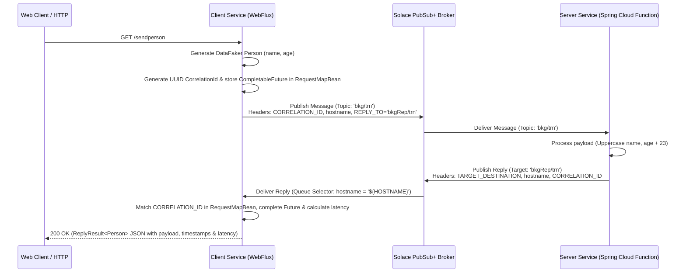

# Solace Request-Reply Microservices

An enterprise asynchronous **Request-Reply Integration Pattern** implementation using **Java 24**, **Spring Boot 3.5**, **Spring Cloud Stream**, **Spring WebFlux**, **DataFaker**, and **Solace PubSub+**.

This repository demonstrates how to execute asynchronous, non-blocking HTTP request-reply workflows across distributed microservices using Solace PubSub+ messaging with dynamic host-based message filtering, correlation tracking, round-trip latency computation, and Kubernetes orchestration via **Skaffold** and **Google Jib**.

---

## 🏗️ Architecture Overview



---

## 📦 Module Breakdown

```
solace-request-reply/
 ├── gradle/
 │    └── libs.versions.toml       # Centralized Gradle version catalog
 ├── solace-library/               # Reusable Solace Request-Reply library
 ├── client/                       # WebFlux REST microservice & reply consumer
 ├── server/                       # Backend consumer service (Spring Cloud Function)
 ├── k8s-solace-deployment/        # Solace PubSub+ broker & Ingress K8s manifests
 ├── skaffold.yaml                 # Skaffold workflow configuration
 ├── skaffold.env                  # Skaffold default repository environment config
 └── gradle.properties             # Centralized Gradle build properties (container_registry)
```

### Component Summary

| Component | Path | Description |
| :--- | :--- | :--- |
| **`solace-library`** | [`solace-library`](solace-library) | Core library containing request-reply tracking logic: <br/>• [`RequestReplyService`](solace-library/src/main/java/cris/prs/messaging/service/RequestReplyService.java): Header building & message dispatch via `StreamBridge`.<br/>• [`RequestMapBean`](solace-library/src/main/java/cris/prs/messaging/service/RequestMapBean.java): In-memory `ConcurrentHashMap` for correlation tracking.<br/>• [`ReplyProcessor`](solace-library/src/main/java/cris/prs/messaging/service/ReplyProcessor.java): Reply correlation matching & latency calculation.<br/>• [`ReplyResult`](solace-library/src/main/java/cris/prs/messaging/ReplyResult.java): Encapsulates payload, send/receive timestamps, and latency. |
| **`client`** | [`client`](client) | Reactive WebFlux REST service with DataFaker integration:<br/>• [`RestService`](client/src/main/java/cris/prs/messaging/rest/RestService.java): Exposes REST endpoints (`/test`, `/sendperson`, `/send-bulk-stream`).<br/>• [`ReplyConsumer`](client/src/main/java/cris/prs/messaging/reply/consumers/ReplyConsumer.java): Configures `myReplyConsumer` using `hostname = '${HOSTNAME}'` message selector. |
| **`server`** | [`server`](server) | Backend processing service:<br/>• [`ServiceConsumer`](server/src/main/java/cris/prs/messaging/consumer/ServiceConsumer.java): Spring Cloud Function `booking` (`Function<Message<Person>, Message<Person>>`) transforming payloads and generating targeted replies. |
| **`k8s-solace-deployment`** | [`k8s-solace-deployment`](k8s-solace-deployment) | Solace PubSub+ Event Broker custom resource ([`solace.yaml`](k8s-solace-deployment/solace.yaml)) and NGINX Ingress rules ([`solace-ingress.yaml`](k8s-solace-deployment/solace-ingress.yaml)). |

---

## 🛠️ Key Technical Patterns

1. **Asynchronous Correlation Tracking**:
   When a request is published by [`RequestReplyService`](solace-library/src/main/java/cris/prs/messaging/service/RequestReplyService.java), a unique UUID `CORRELATION_ID` is assigned and an incomplete `CompletableFuture<ReplyResult<R>>` is stored in [`RequestMapBean`](solace-library/src/main/java/cris/prs/messaging/service/RequestMapBean.java).

2. **Host-Selective Reply Queuing**:
   Each client instance registers a Solace queue consumer selector (`hostname = '${HOSTNAME}'`) in [`client/src/main/resources/application.yaml`](client/src/main/resources/application.yaml#L29). This ensures reply messages are delivered strictly to the client instance that originated the request, even when scaled across multiple pods.

3. **DataFaker Integration**:
   [`RestService`](client/src/main/java/cris/prs/messaging/rest/RestService.java) uses `net.datafaker:datafaker` (`v2.4.2`) to dynamically generate realistic `Person` attributes (`name`, `age`) for single requests and high-concurrency reactive streams.

4. **Latency Measurement**:
   When the reply arrives, [`ReplyProcessor`](solace-library/src/main/java/cris/prs/messaging/service/ReplyProcessor.java) records `receiveTime`, calculates `latency = receiveTime - sendTime`, removes the correlation ID, and completes the future.

---

## ⚙️ Spring Cloud Function Mapping & `application.yaml` Configuration

Spring Cloud Stream maps Spring Java Bean functions (`Consumer`, `Function`, `Supplier`) to messaging channels using standard naming conventions: `<functionName>-in-0` for inputs and `<functionName>-out-0` for outputs.

### 1. Client Module Mapping ([`client/src/main/resources/application.yaml`](client/src/main/resources/application.yaml))

```yaml
spring:
  cloud:
    function:
      definition: myReplyConsumer        # 1. Spring Bean name defined in ReplyConsumer.java
    stream:
      bindings:
        myReplyConsumer-in-0:            # 2. Input channel binding for 'myReplyConsumer'
          destination: bkgRep            # 3. Base Solace queue name
          group: bkgRepGrp               # 4. Solace Consumer Group (bkgRep.bkgRepGrp)
          consumer:
            concurrency: 10              # 5. Number of concurrent listener threads
      binders:
        local-solace:
          type: solace
          environment:
            solace:
              java:
                host: tcp://broker-pubsubplus:55555
                msgVpn: default
                clientUsername: default
                clientPassword: default
      solace:
        bindings:
          myReplyConsumer-in-0:
            consumer:
              selector: "hostname = '${HOSTNAME}'" # 6. Hostname message selector
              queueAdditionalSubscriptions:
                - bkgRep/trn             # 7. Topic subscription bound to the queue
```

* **Java Bean Link**: `spring.cloud.function.definition: myReplyConsumer` maps to the `@Bean Consumer<Message<Person>> myReplyConsumer()` in [`ReplyConsumer.java`](client/src/main/java/cris/prs/messaging/reply/consumers/ReplyConsumer.java).
* **Solace Queue Setup**: Provisions queue `bkgRep.bkgRepGrp` with subscription `bkgRep/trn`.
* **Host Filtering**: `selector: "hostname = '${HOSTNAME}'"` filters messages on the broker side, ensuring each client pod only receives replies matching its container hostname.

---

### 2. Server Module Mapping ([`server/src/main/resources/application.yaml`](server/src/main/resources/application.yaml))

```yaml
spring:
  cloud:
    function:
      definition: booking                # 1. Spring Bean name defined in ServiceConsumer.java
    stream:
      bindings:
        booking-in-0:                    # 2. Input channel binding for 'booking' function
          destination: bkg                # 3. Base Solace queue name
          group: bkgGrp                   # 4. Solace Consumer Group (bkg.bkgGrp)
          consumer:
            concurrency: 10              # 5. Concurrent listener threads
      solace:
        bindings:
          booking-in-0:
            consumer:
              queueAdditionalSubscriptions: # 6. Additional topic subscriptions
                - bkg/trn
                - bkg/trn/>
```

* **Java Bean Link**: `spring.cloud.function.definition: booking` maps to the `@Bean Function<Message<Person>, Message<Person>> booking()` in [`ServiceConsumer.java`](server/src/main/java/cris/prs/messaging/consumer/ServiceConsumer.java).
* **Input Queue**: `<functionName>-in-0` (`booking-in-0`) binds to queue `bkg.bkgGrp` listening on topics `bkg/trn` and `bkg/trn/>`.
* **Dynamic Header Routing**: The `booking` function returns a `Message<Person>` created via `rrs.sendReplyToMessage(msg.getHeaders(), payload)`. This sets `BinderHeaders.TARGET_DESTINATION` to the `REPLY_TO` topic (`bkgRep/trn`) specified in incoming request headers, allowing Spring Cloud Stream to route replies back dynamically without requiring a static output channel binding (`booking-out-0`).

---

## 🔧 Build & Registry Configuration

### Registry Management via `gradle.properties`

The container registry hostname is defined centrally in [`gradle.properties`](gradle.properties):

```properties
container_registry=quay.prs
```

Subprojects ([`client/build.gradle`](client/build.gradle#L22) & [`server/build.gradle`](server/build.gradle#L22)) extract this property directly:

```groovy
ext {
    set('container_registry', project.findProperty('container_registry'))
}
```

Jib constructs base image and destination image tags automatically using `${container_registry}`:

```groovy
jib {
    from {
        image = "${container_registry}/apos/base-images/ubi9/spring-app:jre-24.0.1-v0.1.0@sha256:8738e693608dcddd322ecf5c2732ac7912c7c63d7dd7533498cba8ef527e97f1"
    }
    to {
        image = "${container_registry}/basak.anupam/${project.name.toLowerCase()}"
    }
}
```

No environment variables are required. Skaffold resolves the default target repository namespace via [`skaffold.env`](skaffold.env):

```env
SKAFFOLD_DEFAULT_REPO=quay.prs/basak.anupam
```

---

## 🚀 Running with Skaffold

### Prerequisites

Ensure the following tools are installed:
* **Java 24** (or compatible JDK)
* **Gradle**
* **Skaffold** (v2.x / v4.x)
* **Docker / Podman**
* A **Kubernetes / OpenShift** cluster
* Solace PubSub+ broker accessible at `tcp://broker-pubsubplus:55555` inside the cluster namespace

### Launching Development Mode (`skaffold dev`)

To build container images via Jib, deploy manifests to Kubernetes, and stream logs in real time:

```bash
skaffold dev
```

During execution, Skaffold:
1. Triggers Gradle Jib builds for `server` and `client`.
2. Resolves artifact images (`quay.prs/basak.anupam/server` and `quay.prs/basak.anupam/client`).
3. Deploys [`server/k8s/deployment.yaml`](server/k8s/deployment.yaml) and [`client/k8s/deployment.yaml`](client/k8s/deployment.yaml).
4. Watches source files and automatically re-deploys upon code modifications.

---

## 🧪 Testing API Endpoints

### 1. Port Forwarding

If running inside Kubernetes, port-forward port `8080` to the `client` service:

```bash
kubectl port-forward svc/client 8080:80 -n anupam
```

---

### 2. Endpoints & Sample Responses

#### A. Basic Health Check
Verify WebFlux availability:
```bash
curl http://localhost:8080/test
```
*Response:*
```
OK Hello World
```

---

#### B. Single Person Request-Reply (`/sendperson`)
Triggers a Solace request-reply cycle using a DataFaker-generated `Person` payload:
```bash
curl http://localhost:8080/sendperson
```
*Sample Response:*
```json
{
  "payload": {
    "name": "ALEXANDER HAMILTON",
    "age": 58
  },
  "sendTime": 1770982800000,
  "receiveTime": 1770982800018,
  "latency": 18
}
```
*(Note: The server service transforms the payload by upper-casing `name` and adding 23 to `age`.)*

---

#### C. Reactive Bulk Streaming Benchmark (`/send-bulk-stream`)
Triggers high-concurrency request-reply processing for 100,000 DataFaker `Person` objects across 1,000 parallel reactive streams:
```bash
curl http://localhost:8080/send-bulk-stream
```
*Response:* HTTP chunked Flux stream yielding each `ReplyResult<Person>` JSON object with round-trip latency data.

---

## 📋 Technology Stack & Versions

| Layer | Technology | Version |
| :--- | :--- | :--- |
| **Language** | Java | 24 |
| **Framework** | Spring Boot / Spring Cloud Stream / WebFlux | 3.5.4 / 2025.0.0 |
| **Messaging** | Solace PubSub+ (Jakarta JMS / Solace Binder) | 10.27.2 / 4.4.0 |
| **Data Generation** | DataFaker | 2.4.2 |
| **Containerization** | Google Cloud Jib Gradle Plugin | 3.4.5 |
| **Orchestration** | Skaffold / Kubernetes / OpenShift | Skaffold v4beta14 |
