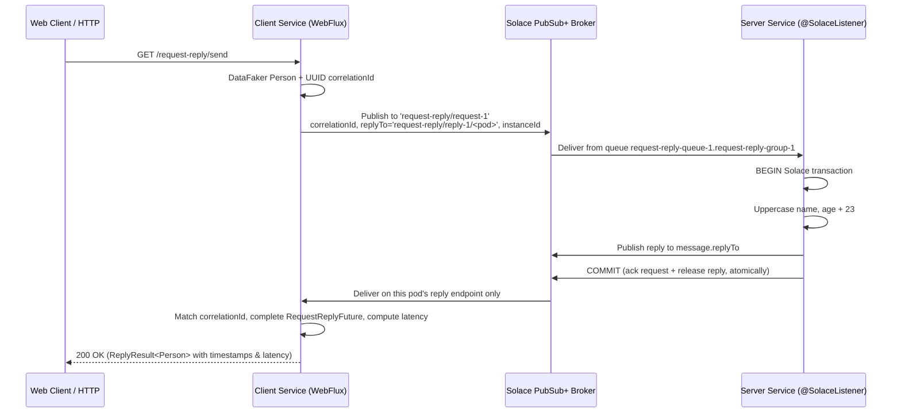

# Solace Request-Reply Microservices

An asynchronous **Request-Reply** implementation over **Solace PubSub+**, built on a small Spring
library that gives Solace the same programming model **[Spring for Apache Kafka](https://spring.io/projects/spring-kafka)**
gives Kafka: `SolaceTemplate`, `ReplyingSolaceTemplate`, `@SolaceListener`, `@EnableSolace`,
listener containers with configurable concurrency, and Spring-managed
[Solace transactions](https://docs.solace.com/Messaging/Guaranteed-Msg/Transactions.htm).

Spring Cloud Stream and the Solace binder (`com.solace.spring.cloud:spring-cloud-starter-stream-solace`)
have been removed; everything now sits directly on **JCSMP** through the
`solace-java-spring-boot-starter`.

---

## 🏗️ Architecture Overview



---

## 🧩 The Solace library (`solace-library`)

> **The library has its own documentation set:** [`solace-library/README.md`](solace-library/README.md),
> as eighteen numbered guides under [`solace-library/docs/`](solace-library/docs/) — start with
> [1. Overview](solace-library/docs/01-overview.md) and [2. Getting started](solace-library/docs/02-getting-started.md),
> or go straight to [4. Spring integration](solace-library/docs/04-spring-integration.md),
> [5. Configuration](solace-library/docs/05-configuration.md) or
> [17. Troubleshooting](solace-library/docs/17-troubleshooting.md). What follows is the short version.

Everything lives under `cris.prs.messaging.solace`.

| Spring for Apache Kafka | This library |
| :--- | :--- |
| `@EnableKafka` | `@EnableSolace` |
| `@KafkaListener` | `@SolaceListener` |
| `KafkaTemplate` | `SolaceTemplate` |
| `ReplyingKafkaTemplate` | `ReplyingSolaceTemplate` |
| `ProducerFactory` / `ConsumerFactory` | `SolaceSessionFactory` |
| `ConcurrentKafkaListenerContainerFactory` | `DefaultSolaceListenerContainerFactory` |
| `KafkaListenerEndpointRegistry` | `SolaceListenerEndpointRegistry` |
| `KafkaTransactionManager` | `SolaceTransactionManager` |
| `ConsumerRecord<K,V>` | `SolaceRecord<T>` |
| `ContainerProperties` | `ContainerProperties` |

### Auto-configuration

`SolaceAutoConfiguration` lives in `cris.prs.solace.autoconfigure` — outside the applications'
component scanned `cris.prs.messaging` package, as a starter should — and is registered in
`META-INF/spring/org.springframework.boot.autoconfigure.AutoConfiguration.imports`, running after
the Solace starter's own auto-configuration. Putting `solace-library` on the classpath is enough to
get:

* `SolaceSessionFactory` on top of the starter's `SpringJCSMPFactory`
* `SolaceTemplate` (`solaceTemplate`)
* `ReplyingSolaceTemplate` + its per-instance reply container
* `solaceListenerContainerFactory`
* `SolaceTransactionManager`
* `@SolaceListener` detection — the auto-configuration applies `@EnableSolace` for you, exactly as
  Spring Boot applies `@EnableKafka`. Declare `@EnableSolace` yourself only when auto-configuration
  is switched off.

### Producing

`SolaceTemplate` is the primary bean, so an unqualified injection always gets the plain template
even when request-reply is enabled (`ReplyingSolaceTemplate` extends it, so both beans match the
supertype). Inject `ReplyingSolaceTemplate` by its own type when you want `sendAndReceive`.

```java
@Autowired SolaceTemplate<Object> solace;

solace.send("request-reply/request-1", person);
solace.send("request-reply/request-1", correlationId, person);
solace.send("request-reply/request-1", person, Map.of("tenant", "north"));   // extra headers become SDT properties
```

### Consuming

```java
@SolaceListener(
        id = "booking",
        queue = "request-reply-queue-1", group = "request-reply-group-1",   // -> endpoint request-reply-queue-1.request-reply-group-1
        topics = {"request-reply/request-1", "request-reply/request-1/>"},
        concurrency = "10",
        transactional = "true")
public Person booking(Person person,
        @Header(name = SolaceHeaders.CORRELATION_ID, required = false) String correlationId) {
    person.setName(person.getName().toUpperCase());
    person.setAge(person.getAge() + 23);
    return person;                                 // published to the request's replyTo
}
```

Supported parameters: the converted payload, `Message<T>`, `SolaceRecord<T>`, the raw
`BytesXMLMessage`, and `@Payload` / `@Header` / `@Headers`. A non-void return value is published to
the request's `replyTo` (or to `replyDestination` when set on the annotation).

### Request-reply

```java
@Autowired ReplyingSolaceTemplate solace;

RequestReplyFuture<Person> future = solace.sendAndReceive("request-reply/request-1", person, Person.class);
Person reply = future.get();          // or Mono.fromFuture(future)
long latency = future.getLatency();
```

---

## 🔀 Message exchange patterns

The three [Solace message exchange patterns](https://docs.solace.com/Get-Started/message-exchange-patterns.htm)
are declared on the listener, not assembled from configuration:

```java
@SolaceListener(pattern = "PUBLISH_SUBSCRIBE", topics = "notification/broadcast", queue = "notification")
public void onNotification(Notification notification) { ... }

@SolaceListener(pattern = "POINT_TO_POINT", topics = "task/submit", queue = "task", group = "workers")
public void onTask(Task task) { ... }

@SolaceListener(pattern = "REQUEST_REPLY", topics = "request-reply/request-1",
                queue = "request-reply-queue-1", group = "request-reply-group-1")
public Person booking(Person person) { ... }      // return value goes back to the requester
```

**Publishing is pattern agnostic.** A producer sends to a topic and is done — `solace.send(topic, payload)`
is identical in all three cases. What makes a message fan out to everyone or go to exactly one worker
is *how the consumers bind*, and that is the whole job of `pattern`:

| | Who receives a message | Endpoint | Access type | Flows | Scaling out means |
| :--- | :--- | :--- | :--- | :--- | :--- |
| `PUBLISH_SUBSCRIBE` | **every** instance, its own copy | one per instance, `notification.<instance-id>`, non-durable | exclusive | 1 | more processing of the same messages |
| `POINT_TO_POINT` | **exactly one** instance | one shared, `task.workers`, durable | non-exclusive | `concurrency` | more throughput |
| `REQUEST_REPLY` | one instance, which replies | shared request endpoint `request-reply-queue-1.request-reply-group-1`; reply to the request's `replyTo` | non-exclusive | `concurrency` | more throughput |

`PUBLISH_SUBSCRIBE` pins concurrency to one flow, because an exclusive endpoint admits a single
consumer — binding more is not slow, it is refused (`503 Max clients exceeded for queue`).
Parallelism in fan-out comes from running more instances, which is the whole point of the pattern.
The other two share a non-exclusive endpoint, so they consume with `solace.listener.concurrency`
flows each.

The difference between the first two rows is a single decision — whether each instance gets its own
endpoint or they all share one — which is exactly why it is worth naming once rather than expressing
as three flags that have to agree. Anything you set explicitly still wins; the pattern only fills in
what you left out:

```java
// Fan-out that survives restarts: still one endpoint per instance, but durable.
@SolaceListener(pattern = "PUBLISH_SUBSCRIBE", endpointMode = "DURABLE_QUEUE", ...)
```

### Seeing it work

Each pattern has its own controller, and each offers the same three verbs:

```bash
curl "http://localhost:8080/pub-sub/publish?message=deploy+finished"    # fan-out, one message
curl "http://localhost:8080/pub-sub/publish-multiple?count=5"           # five independent publishes
curl "http://localhost:8080/pub-sub/publish-batch?count=5"              # five in one transaction

curl "http://localhost:8080/point-to-point/submit?description=reindex"  # one worker takes it
curl "http://localhost:8080/point-to-point/submit-multiple?count=5"
curl "http://localhost:8080/point-to-point/submit-batch?count=5"

curl "http://localhost:8080/request-reply/booking/send"                  # service one -> Person
curl "http://localhost:8080/request-reply/booking/send-multiple?count=10"
curl "http://localhost:8080/request-reply/booking/send-batch?count=5"

curl "http://localhost:8080/request-reply/quote/send"                   # service two -> Quote
curl "http://localhost:8080/request-reply/quote/send-multiple?count=10"
curl "http://localhost:8080/request-reply/quote/send-batch?count=5"

curl "http://localhost:8080/request-reply/inventory/send"               # service three -> InventoryStatus
curl "http://localhost:8080/request-reply/inventory/send-multiple?count=10"
curl "http://localhost:8080/request-reply/inventory/send-batch?count=5"
```

Scale the server to prove the distinction:

```bash
kubectl scale deployment/server --replicas=3 -n anupam
kubectl logs -l app=server -n anupam --tail=50 | grep -E "Notification|Task"
```

One notification appears in **all three** pods' logs; one task appears in **exactly one**.

## 🌐 Multi-instance handling: the reply topic carries the pod name

Every instance resolves an **instance id** (`HostnameInstanceIdProvider`) from, in order:

1. `solace.instance-id` if set
2. the `HOSTNAME` environment variable (set by Kubernetes to the pod name)
3. the `POD_NAME` environment variable (declared explicitly in `client/k8s/deployment.yaml`)
4. the local host name, else a random suffix

That id becomes the last level of the reply topic and, for queue based modes, part of the reply
endpoint name:

```
reply topic     request-reply/reply-1/client-7d9f4c8b6-xk2mp
reply endpoint  request-reply.reply-1.client-7d9f4c8b6-xk2mp
```

Each request carries that topic in its `replyTo` field, so the server replies to the exact pod that
asked. Scaling the client out needs no configuration change, and the old broker side selector
(`hostname = '${HOSTNAME}'`) is gone — routing is now structural rather than filtered.

### Reply endpoint modes

`solace.request-reply.endpoint-mode` (and `solace.listener.endpoint-mode` for `@SolaceListener`
containers) selects the delivery guarantee:

| Mode | Endpoint | Guarantee | Notes |
| :--- | :--- | :--- | :--- |
| `DURABLE_QUEUE` | provisioned, named `<queue>.<group>.<instance-id>` | guaranteed, survives restarts | queues of dead pods need cleanup |
| `NON_DURABLE_QUEUE` *(default for replies)* | temporary queue | guaranteed while connected | broker removes it on disconnect |
| `DIRECT` | none — plain topic subscription | at-most-once, non-persistent | lowest latency, no acks or transactions |

### Dispatch modes: where the listener runs

`solace.listener.dispatch` (or `@SolaceListener(dispatch = "...")`) chooses the thread the listener
is invoked on:

| Mode | Listener runs on | Notes |
| :--- | :--- | :--- |
| `INLINE` *(default)* | the JCSMP delivery thread | lowest latency; the only correct mode for transacted flows |
| `EXECUTOR` | a Spring `AsyncTaskExecutor` | one invoker task per flow, as `DefaultMessageListenerContainer` does for JMS |

In `EXECUTOR` mode the delivery thread only hands the message to a bounded queue
(`solace.listener.dispatch-queue-capacity`, default 256) and returns, so it stays free to receive
while the listener works. The queue **blocks** when full, which pushes back onto the delivery thread
and from there onto the broker's transport window — flow control is preserved rather than being
replaced by unbounded buffering. Listeners then run on the `solaceListenerTaskExecutor` bean, a
`SimpleAsyncTaskExecutor` with non-daemon threads named `solace-<listener-id>-<n>`; replace that bean
to use your own executor, propagate MDC, or switch to virtual threads.

Because those threads are non-daemon, `EXECUTOR` dispatch also keeps a consumer-only application
alive on its own, so `solace.listener.keep-alive` can be turned off. (Virtual threads are daemon
threads — if you swap in a virtual thread executor, leave keep-alive on.)

> ⚠️ **`EXECUTOR` is rejected for transactional containers**, and deliberately so. A Solace
> transacted session's `commit()` acknowledges *every* message delivered on that session so far, not
> just the one in hand. Buffering messages off the delivery thread would let a commit cover messages
> that have not been processed yet, and a rollback redeliver ones that have. Transactional listeners
> stay `INLINE`; their parallelism already comes from running `concurrency` independent flows, each
> with its own transacted session and its own delivery thread.

### Poison messages: max-redelivery-count and the dead message queue

A transactional listener rolls back when the listener throws, and the broker redelivers. That is the
right response to a transient failure and the wrong one for a message that can *never* be handled —
a malformed payload redelivers forever. The cure is broker side:

```yaml
solace:
  listener:
    endpoint:
      max-redelivery-count: 5      # 0 = broker default, retry without limit
      dead-message-queue:
        provision: true            # create #DEAD_MSG_QUEUE at startup if missing
        name: "#DEAD_MSG_QUEUE"
        quota-mb: 100
```

Three things must all hold for a message to reach the DMQ, and the library covers each:

1. the message was published **DMQ eligible** — `SolaceTemplate` sets that by default
   (`solace.template.dmq-eligible`)
2. the consuming endpoint has a **max-redelivery-count**
3. the **DMQ exists**. Solace allows exactly one per message VPN and it must be named
   `#DEAD_MSG_QUEUE`; the container provisions it when `provision: true`. It is deliberately created
   with `respectsTTL` disabled, because the broker rejects a DMQ that respects TTL — expiry is one of
   the things that sends a message there in the first place.

> ⚠️ **Endpoint properties apply only at creation.** Provisioning never reconfigures an endpoint that
> already exists, so adding `max-redelivery-count` to a queue the broker already has changes nothing.
> The container logs a warning when it detects this (`ENDPOINT_PROPERTY_MISMATCH`). To apply it,
> delete the queue on the broker so it is recreated, or set it through the admin UI or SEMP.

### Transacted sessions are a per-connection budget

A transactional container takes **one transacted session per flow**, and Solace allows only so many
per client connection — 10 by default. Two transactional listeners at concurrency 10 and 5 need 15
between them, which one connection will not give (`503 Max Transacted Sessions Exceeded`).

So each transactional container opens its **own connection** for its transacted sessions, rather
than competing for the shared session's allowance with every other container in the application.
Non-transactional containers and all publishing stay on the shared session.

That leaves one rule to respect: a single container's `concurrency` must fit inside the per-connection
limit. The container checks this at startup and refuses with an explanatory message rather than
letting the broker reject the 11th bind:

```yaml
solace:
  listener:
    concurrency: 10
    max-transacted-sessions-per-connection: 10   # match the broker's client profile
```

The `SolaceTransactionManager` path — `@Transactional` on the requesting side — takes transacted
sessions from the shared session for the life of each transaction, so the limit there applies to
*concurrent in-flight transactions*, not to configuration.

### Keeping a consumer-only application alive

Every JCSMP thread is a daemon thread, so a listener-only Spring Boot service with no web server
would return from `SpringApplication.run` and shut down immediately. A running listener container
therefore holds one shared non-daemon thread, exactly as Spring's JMS and Kafka containers do via
their executors. Set `solace.listener.keep-alive: false` if you would rather add a web starter and
let the servlet/Netty container own the process lifetime.

---

## 💳 Transactions

`SolaceTransactionManager` is a `PlatformTransactionManager` backed by a JCSMP `TransactedSession`,
so Solace local transactions are driven the ordinary Spring way, on both sides.

**Server — consume and reply atomically.** A transactional container creates one transacted session
per flow and binds it before invoking the listener, so the commit both acknowledges the request and
releases the reply. If the listener throws, the transaction rolls back and the broker redelivers.

```yaml
solace:
  listener:
    transactional: true
```

**Client — publish inside a transaction.**

```java
@Transactional
public RequestReplyFuture<Person> sendInTransaction(String topic, Person person) {
    return solace.sendAndReceive(topic, person, Person.class);
}
```

or programmatically:

```java
transactionTemplate.execute(status -> solace.sendAndReceive(topic, person, Person.class));
```

> ⚠️ A message published in a transaction only reaches the broker at commit. Await the
> `RequestReplyFuture` **after** the transactional method returns — waiting inside the transaction
> would block on a request that has not been sent yet. `/request-reply/send-batch` shows the correct
> pattern: the transactional call returns first, and only then are the futures awaited.

---

## ⚙️ Configuration

Broker connection (from `solace-java-spring-boot-starter`):

```yaml
solace:
  java:
    host: tcp://broker-pubsubplus:55555
    msgVpn: default
    clientUsername: default
    clientPassword: default
```

Library configuration (`SolaceProperties`):

```yaml
solace:
  instance-id:                     # optional override; defaults to $HOSTNAME / $POD_NAME / host name

  template:
    default-destination:
    delivery-mode: PERSISTENT      # or DIRECT / NON_PERSISTENT
    time-to-live: 0
    dmq-eligible: true

  listener:                        # defaults for every @SolaceListener container
    max-transacted-sessions-per-connection: 10   # match the broker's client profile
    dispatch: INLINE               # or EXECUTOR (non-transactional containers only)
    dispatch-queue-capacity: 256   # per-flow hand-off bound in EXECUTOR dispatch
    keep-alive: true               # hold the JVM open; needed by consumer-only apps with no web server
    endpoint-mode: DURABLE_QUEUE
    concurrency: 10
    transactional: true
    provision-endpoint: true
    ack-on-error: true
    endpoint:
      access-type: NONEXCLUSIVE
      permission: MODIFY_TOPIC
      quota-mb: 100
      respects-ttl: true
      max-redelivery-count: 5      # 0 = retry forever
      dead-message-queue:
        provision: true
        name: "#DEAD_MSG_QUEUE"
        quota-mb: 100

  request-reply:
    enabled: true                  # false on services that never originate requests
    reply-topic-prefix: request-reply/reply-1
    append-instance-id: true
    endpoint-mode: NON_DURABLE_QUEUE
    concurrency: 1
    reply-timeout: 30s
    delivery-mode: PERSISTENT
```

`client/src/main/resources/application.yaml` and `server/src/main/resources/application.yaml` are
the worked examples: the client enables request-reply, the server disables it and turns on a
transactional durable listener.

---

## 📦 Module Breakdown

```
solace-request-reply/
 ├── gradle/libs.versions.toml     # version catalog
 ├── shared-dto/                   # Person, Notification, Task, Quote, InventoryCheck/Status, ReplyResult — the client/server contract
 ├── solace-library/               # the Spring-for-Solace library (auto-configured starter)
 ├── client/                       # WebFlux REST service, requester
 ├── server/                       # @SolaceListener request handler
 ├── k8s-solace-deployment/        # Solace PubSub+ broker & Ingress manifests
 ├── skaffold.yaml / skaffold.env
 └── gradle.properties             # container_registry
```

---

## 🚀 Running

```bash
skaffold dev
kubectl port-forward svc/client 8080:80 -n anupam
```

| Endpoint | Description |
| :--- | :--- |
| `GET /test` | health check |

**Publish-subscribe** — every server instance receives every message.

| Endpoint | Description |
| :--- | :--- |
| `GET /pub-sub/publish?message=…` | one notification |
| `GET /pub-sub/publish-multiple?message=…&count=5` | several, published independently |
| `GET /pub-sub/publish-batch?message=…&count=5` | several, published in one Solace transaction |

**Point-to-point** — exactly one server instance handles each message.

| Endpoint | Description |
| :--- | :--- |
| `GET /point-to-point/submit?description=…` | one task |
| `GET /point-to-point/submit-multiple?description=…&count=5` | several, published independently |
| `GET /point-to-point/submit-batch?description=…&count=5` | several, published in one Solace transaction |

**Request-reply** — each reply returns to the instance that asked, with its latency. Two independent
services answer on the client's shared reply destination and a third brings its own; `/send*` and
`/booking/send*` are the same endpoints.

| Endpoint | Service | Replies with |
| :--- | :--- | :--- |
| `GET /request-reply/booking/send` | one | `Person` |
| `GET /request-reply/booking/send-multiple?count=10&concurrency=10` | one | `Person` |
| `GET /request-reply/booking/send-batch?count=5` | one | `Person` |
| `GET /request-reply/quote/send` | two | `Quote` |
| `GET /request-reply/quote/send-multiple?count=10&concurrency=10` | two | `Quote` |
| `GET /request-reply/quote/send-batch?count=5` | two | `Quote` |
| `GET /request-reply/inventory/send` | three | `InventoryStatus` |
| `GET /request-reply/inventory/send-multiple?count=10&concurrency=10` | three | `InventoryStatus` |
| `GET /request-reply/inventory/send-batch?count=5` | three | `InventoryStatus` |
| `GET /request-reply/benchmark?total=100000&concurrency=1000` | one | high-concurrency load test |
| `GET /request-reply/reply-destination` | — | both reply topics this pod listens on: `shared` and `inventory` |

| Service | Request topic | Endpoint |
| :--- | :--- | :--- |
| one — booking | `request-reply/request-1` | `request-reply-queue-1.request-reply-group-1` |
| two — quote | `request-reply/request-2` | `request-reply-queue-2.request-reply-group-2` |
| three — inventory | `request-reply/request-3` | `request-reply-queue-3.request-reply-group-3` |

A second service needs **its own request topic as well as its own queue**. Two queues subscribed to
the same topic each receive a copy of every request, so both services would answer and the requester
would see one reply and one orphan. Both do share the client's single per-instance reply
destination: the correlation id, not the destination, is what returns each reply to its request.

The inventory service is the exception, and deliberately so. Its client-side
`inventoryReplyingSolaceTemplate` bean is built from a `ReplyEndpointSpec` through
`ReplyingSolaceTemplateFactory`, giving it its own reply queue and its own reply topic
(`request-reply/reply-3/<pod>`). Like the shared one it is a non-durable endpoint, so it binds a
single flow — consuming replies in parallel would need a durable reply queue instead. Split a reply destination out when one of
these holds: a slow service would head-of-line block the others on a shared reply flow, the services
sit in different trust domains, you want the blast radius of a stuck reply flow bounded, or you want
per-service reply metrics. Otherwise share — one endpoint per pod beats pods x services. Nothing
changes on the responder either way: the requester, not the listener, chooses where the reply goes.

Across all three patterns the three verbs mean the same thing:

| | Publishing |
| :--- | :--- |
| **single** | one message |
| **multiple** | N independent publishes — each on the wire as it is sent, so a failure part way through leaves the earlier ones delivered |
| **batch** | N publishes in one Solace local transaction — nothing reaches the broker until commit, so consumers see all of them or none |

```json
{
  "payload": { "name": "ALEXANDER HAMILTON", "age": 58 },
  "sendTime": 1770982800000,
  "receiveTime": 1770982800018,
  "latency": 18
}
```

---

## 🧪 Tests

```bash
gradle :solace-library:test :client:test :server:test
```

| Test | Covers |
| :--- | :--- |
| `client` &middot; `NotificationPublisherTest` | the broadcast producer addresses a topic and stamps each notification with its own id; single, multiple and batch each emit one message per notification |
| `client` &middot; `TaskDispatcherTest` | one publish per task across single, multiple and batch |
| `client` &middot; `PersonFactoryTest` | the payload source shared by all three controllers |
| `server` &middot; `NotificationSubscriberTest` | every delivered copy is processed; the handler returns void |
| `server` &middot; `TaskWorkerTest` | each task handed to this instance is processed once |
| `server` &middot; `QuoteConsumerTest` | the second service replies with a type derived from the request |
| `server` &middot; `InventoryConsumerTest` | the third service maps its request type to a different reply type |
| `solace-library` &middot; `SolaceObservabilityTest` | what the Micrometer collaborators publish, and what makes the health indicator report DOWN |
| `server` &middot; `ExchangePatternConfigurationTest` | the wiring each `pattern` implies — endpoint naming, durability and access type |

`ExchangePatternConfigurationTest` is the one worth reading. It pins down the difference between the
patterns at the level where it can silently go wrong: that `POINT_TO_POINT` resolves to the *same*
endpoint name on every instance (`task.workers` regardless of host) while `PUBLISH_SUBSCRIBE`
resolves to a different one per instance. Get that backwards and nothing throws — the service just
quietly duplicates every task, or drops two thirds of them.

The tests need no broker: they exercise the handlers and the endpoint resolution directly, with the
template mocked. End-to-end behaviour is verified by scaling the deployment as shown above.

## 📋 Technology Stack

| Layer | Technology | Version |
| :--- | :--- | :--- |
| Language | Java | 24 |
| Framework | Spring Boot / WebFlux | 3.5.4 |
| Messaging | Solace JCSMP / `solace-spring-boot-bom` | 10.27.2 / 2.5.0 |
| Data generation | DataFaker | 2.4.2 |
| Containerization | Google Jib | 3.4.5 |
| Orchestration | Skaffold / Kubernetes | v4beta14 |
