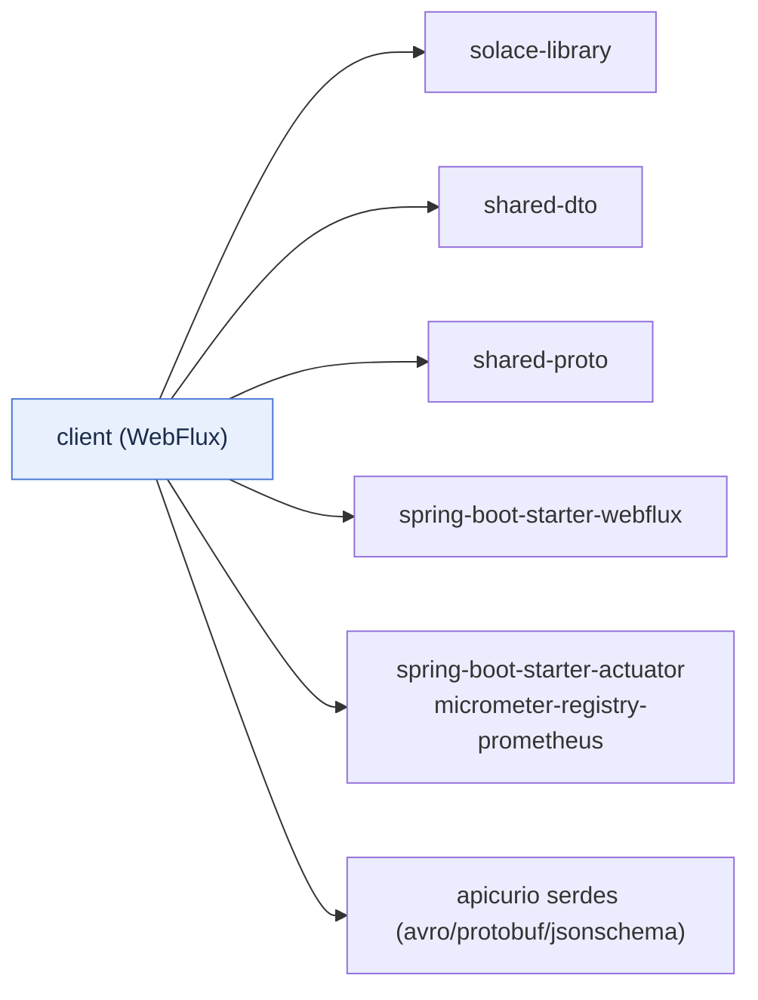
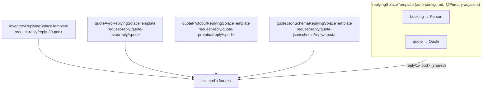
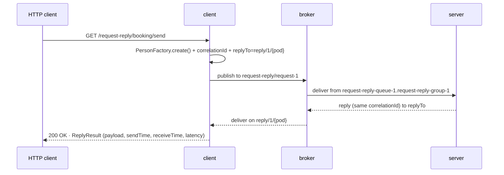

# client

The **requester** in the reference application: a Spring WebFlux service that originates every message
and exposes one REST controller per exchange pattern. It is a worked example of using
[`solace-library`](../solace-library/README.md) from the sending side — `SolaceTemplate`,
`ReplyingSolaceTemplate`, split reply destinations, transactions, schema-registry payloads, and
operator browsing — with nothing Solace-specific written by hand beyond configuration and a few beans.

> Part of the `solace-request-reply` workspace. See
> [`solace-library/docs/04-modules.md`](../solace-library/docs/04-modules.md) for how all five modules
> fit together, and the library's [documentation index](../solace-library/docs/00-index.md) for the
> concepts referenced below.

---

## What it depends on



`shared-proto` supplies the generated Protobuf messages for the Protobuf schema-registry demo;
`shared-dto` supplies every other payload and the `ReplyResult<T>` envelope. The Apicurio serde modules
are `implementation` here (the library declares them `compileOnly`, so an application opts in per
format).

---

## Package layout

```
cris.prs.messaging
 ├── boot/App.java                     @SpringBootApplication, @ComponentScan("cris.prs.messaging")
 ├── rest/                             one controller per exchange pattern
 │    ├── HealthRestService            GET /test
 │    ├── PublishSubscribeRestService  /pub-sub/*
 │    ├── PointToPointRestService      /point-to-point/*
 │    ├── RequestReplyRestService      /request-reply/*  (booking, quote, inventory)
 │    ├── SchemaRegistryRestService    /request-reply/quote-{avro,protobuf,jsonschema}/*
 │    └── AdminRestService             /admin/*  (operator browsing & replay)
 ├── service/                          producers and payload factories
 │    ├── NotificationPublisher        publish-subscribe producer
 │    ├── TaskDispatcher               point-to-point producer
 │    ├── BookingRequestService        request-reply, shared reply destination → Person
 │    ├── QuoteRequestService          request-reply, shared reply destination → Quote
 │    ├── InventoryRequestService      request-reply, OWN reply destination → InventoryStatus
 │    ├── Quote{Avro,Protobuf,JsonSchema}RequestService  the governed quote demos
 │    ├── PersonFactory                DataFaker sample Person payloads
 │    └── InventoryCheckFactory        sample InventoryCheck payloads
 └── spring/config/AppConfig.java      TransactionTemplate + the extra reply templates
```

There is deliberately **no reply-consumer class**: the reply container is auto-configured and owned by
`ReplyingSolaceTemplate`. The client only *sends* — how replies come back is the library's job.

---

## The REST surface

Every pattern offers the same three verbs, which behave differently on failure:

| Verb | Meaning | Failure behaviour |
| :--- | :--- | :--- |
| **single** (`/…`) | one message | it published, or it did not |
| **multiple** (`/…-multiple`) | N independent publishes | a failure part way through leaves the earlier ones delivered |
| **batch** (`/…-batch`) | N publishes in one Solace transaction | consumers see all of them or none |

### Publish-subscribe · `PublishSubscribeRestService`

| Endpoint | Does |
| :--- | :--- |
| `GET /pub-sub/publish?message=…` | one notification (every server pod receives it) |
| `GET /pub-sub/publish-multiple?count=5` | several, published independently |
| `GET /pub-sub/publish-batch?count=5` | several, in one transaction |

### Point-to-point · `PointToPointRestService`

| Endpoint | Does |
| :--- | :--- |
| `GET /point-to-point/submit?description=…` | one task (exactly one server pod handles it) |
| `GET /point-to-point/submit-multiple?count=5` | several, published independently |
| `GET /point-to-point/submit-batch?count=5` | several, in one transaction |

### Request-reply · `RequestReplyRestService`

Two services share the per-instance reply destination; inventory brings its own. Every response is a
`ReplyResult<T>` — the payload plus `sendTime`, `receiveTime` and `latency` (round-trip time measured by
the requester). `/send*` and `/booking/send*` are the same endpoints.

| Endpoint | Service | Replies with |
| :--- | :--- | :--- |
| `GET /request-reply/booking/send` (`-multiple`, `-batch`) | booking | `Person` |
| `GET /request-reply/quote/send` (`-multiple`, `-batch`) | quote | `Quote` |
| `GET /request-reply/inventory/send` (`-multiple`, `-batch`) | inventory | `InventoryStatus` |
| `GET /request-reply/benchmark?total=100000&concurrency=1000` | booking | high-concurrency load test |
| `GET /request-reply/reply-destination` | — | both reply topics this pod listens on: `shared` and `inventory` |

`-multiple` and `benchmark` stream replies back **as they arrive** (ordered by latency, not by request);
`-batch` publishes the requests in a transaction and only *then* awaits the futures — waiting inside the
transaction would block on requests not yet on the wire. This is the subtlety the batch endpoints exist
to demonstrate.

### Schema-registry demos · `SchemaRegistryRestService`

The quote service again, three more times, with its payloads governed by
[Apicurio Registry](../solace-library/docs/12-schema-registry.md). Same question, same `Quote` returned
by the REST layer — only the wire format differs.

| Endpoint | Format | On the wire |
| :--- | :--- | :--- |
| `GET /request-reply/quote-avro/send` (`-multiple`, `-batch`) | Avro | shared `Person`→`Quote` by Avro reflection |
| `GET /request-reply/quote-protobuf/send` (`-multiple`, `-batch`) | Protobuf | generated `QuoteRequest`→`QuoteReply` |
| `GET /request-reply/quote-jsonschema/send` (`-multiple`, `-batch`) | JSON Schema | shared DTOs as schema-validated JSON |
| `GET /request-reply/schema-registry/reply-destination` | — | the three demos' own reply topics |

### Operator endpoints · `AdminRestService`

Browsing reads a queue **without consuming it**, so nothing is taken from the consumer that should
process it. Each runs on `boundedElastic` because browsing blocks on the network.

| Endpoint | Does |
| :--- | :--- |
| `GET /admin/queue/depth?queue=task.workers&limit=1000` | count what is spooled (walks the queue; `limit` bounds the work) |
| `GET /admin/queue/peek?queue=task.workers&limit=10` | first few messages, with their delivery counts |
| `GET /admin/dmq/peek?limit=10` | look inside `#DEAD_MSG_QUEUE` — the messages the app gave up on |
| `GET /admin/containers` | every listener container: running, degraded, active, last flow event, replay setting |
| `GET /admin/replay?listenerId=…&from=BEGINNING` | re-deliver spooled messages (**affects the whole endpoint**) |

---

## The reply-destination architecture



`AppConfig` builds the four extra templates from a `ReplyEndpointSpec` via `ReplyingSolaceTemplateFactory`
(see [8.6 When to split a reply destination](../solace-library/docs/08-request-reply.md#86-when-to-split-a-reply-destination)):

- **Booking and quote share** the auto-configured `replyingSolaceTemplate` — the right default, since the
  correlation id (not the destination) returns each reply to its request.
- **Inventory has its own** so its replies are isolated: a burst of inventory traffic cannot head-of-line
  block a booking reply on the shared flow, a stalled inventory endpoint cannot stop the other
  conversations, and its depth and latency are readable on their own.
- **Each governed demo has its own** because a reply topic is also a registry mapping
  (`…/reply/>` → one artifact), and the shared destination carries JSON `Person`/`Quote` replies that no
  single mapping can describe.

Because several `ReplyingSolaceTemplate` beans exist, every injection point uses `@Qualifier`
(`replyingSolaceTemplate` is the auto-configured one). `AppConfig` also exposes a `TransactionTemplate`
over the auto-configured `SolaceTransactionManager` for the batch endpoints.

Every spec sets `timeToLive = replyTimeout`: a request is persistent on a durable server endpoint, so it
outlives the responder. Expiring it when the requester stops waiting stops a reply arriving minutes late
to a future that already timed out — the request endpoints are provisioned `respects-ttl` with a DMQ, so
an expired request is parked rather than answered too late.

---

## Configuration (`application.yaml`)

The client **enables** request-reply and points each service's topic and reply prefix through `app.*`
placeholders that the `@SolaceListener`-free producers and `AppConfig` read:

```yaml
solace:
  request-reply:
    enabled: true
    reply-topic-prefix: request-reply/reply-1     # replies arrive on <prefix>/<instance-id>
    append-instance-id: true
    endpoint-mode: NON_DURABLE_QUEUE              # temporary per-pod endpoint
    concurrency: 1
    reply-timeout: 30s
    time-to-live: 30000                           # = reply-timeout; expire abandoned requests
  schema-registry:
    url: ${APICURIO_REGISTRY_URL:http://…/apis/registry/v3}
    destinations: ["request-reply/quote-avro/>", "request-reply/quote-jsonschema/>"]
    # topic-profile mappings, registration.schemas, avro.datum-provider: REFLECT_ALLOW_NULL …
```

The Solace health indicator is wired into the **readiness** group (not liveness), so a broker outage
takes the pod out of the load balancer without restart-looping it. Full property reference:
[15. Configuration](../solace-library/docs/15-configuration.md); the registry block:
[12. Schema Registry](../solace-library/docs/12-schema-registry.md).

---

## A request-reply exchange, end to end



---

## Running

```bash
skaffold dev                                         # from the repo root
kubectl port-forward svc/client 8080:80 -n anupam

curl "http://localhost:8080/pub-sub/publish?message=deploy+finished"
curl "http://localhost:8080/point-to-point/submit?description=reindex"
curl "http://localhost:8080/request-reply/booking/send"
curl "http://localhost:8080/request-reply/quote-avro/send"
curl "http://localhost:8080/admin/dmq/peek?limit=10"
```

Response shape:

```json
{ "payload": { "name": "ALEXANDER HAMILTON", "age": 58 },
  "sendTime": 1770982800000, "receiveTime": 1770982800018, "latency": 18 }
```

---

## See also

- [`server/README.md`](../server/README.md) — the responder side
- [8. Request-reply](../solace-library/docs/08-request-reply.md) · [9. Transactions](../solace-library/docs/09-transactions.md) · [11. Multi-instance](../solace-library/docs/11-multi-instance.md) · [12. Schema Registry](../solace-library/docs/12-schema-registry.md)
