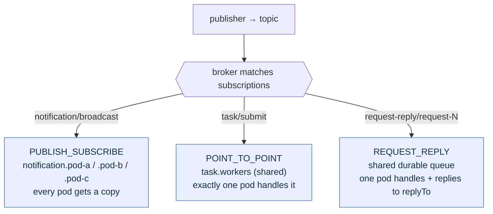

# server

The **responder** in the reference application: a Spring Boot service whose only job is to consume. It
declares one `@SolaceListener` handler per exchange and is a worked example of using
[`solace-library`](../solace-library/README.md) from the receiving side — publish-subscribe fan-out,
point-to-point work-sharing, transactional request-reply, topic dispatch, the dead message queue, and
schema-registry payloads — with nothing written by hand beyond the handler methods and configuration.

> Part of the `solace-request-reply` workspace. See
> [`solace-library/docs/04-modules.md`](../solace-library/docs/04-modules.md) for how all five modules
> fit together, and the library's [documentation index](../solace-library/docs/00-index.md) for the
> concepts referenced below.

---

## What it depends on

The same set as [`client`](../client/README.md): `solace-library`, `shared-dto`, `shared-proto`, WebFlux
(for the Actuator/Prometheus surface and to hold the process open), and the three Apicurio serde modules.
The server **never originates requests**, so it sets `solace.request-reply.enabled: false` and has no
reply container.

---

## The listener catalogue

Every handler is one `@SolaceListener` method in `cris.prs.messaging.consumer`. The `pattern` attribute
picks the endpoint wiring; a non-void return value is the reply.

| Listener (method) | Pattern | Endpoint / topic | In → out | Txn |
| :--- | :--- | :--- | :--- | :--- |
| `ServiceConsumer.booking` | `REQUEST_REPLY` | `request-reply-queue-1.request-reply-group-1` · `request-reply/request-1`(`/>`) | `Person` → `Person` (upper-case name, age+23) | ✔ |
| `QuoteConsumer.quote` | `REQUEST_REPLY` | `…queue-2.…group-2` · `request-reply/request-2`(`/>`) | `Person` → `Quote` | ✔ |
| `InventoryConsumer.check` | `REQUEST_REPLY` | `…queue-3.…group-3` · `request-reply/request-3`(`/>`) | `InventoryCheck` → `InventoryStatus` | ✔ |
| `QuoteAvroConsumer.quote` | `REQUEST_REPLY` | `…queue-4.…group-4` · `request-reply/quote-avro/request` | `Person` → `Quote` as **Avro** | ✔ |
| `QuoteProtobufConsumer.quote` | `REQUEST_REPLY` | `…queue-5.…group-5` · `request-reply/quote-protobuf/request` | `QuoteRequest` → `QuoteReply` as **Protobuf** | ✔ |
| `QuoteJsonSchemaConsumer.quote` | `REQUEST_REPLY` | `…queue-6.…group-6` · `request-reply/quote-jsonschema/request` | `Person` → `Quote` as **validated JSON** | ✔ |
| `NotificationSubscriber.onNotification` | `PUBLISH_SUBSCRIBE` | `notification.<instance-id>` · `notification/broadcast` | `Notification` → `void` | ✘ |
| `NotificationRouter` (3 methods) | `POINT_TO_POINT` | `notification-router.v1` · `routed/…` via topic dispatch | `Notification` → `void` | ✘ |
| `TaskWorker.onTask` | `POINT_TO_POINT` | `task.workers` · `task/submit` | `SolaceRecord<Task>` → `void` | ✔ |

`QuotePricing` (package-private) holds the pricing logic shared by all four quote services;
`QuoteProtoMapper` (from `shared-proto`) maps the Protobuf messages to and from the shared DTOs.

### How `pattern` decides delivery



The distinction is pinned by `ExchangePatternConfigurationTest`: `POINT_TO_POINT` resolves to the **same**
endpoint name on every instance while `PUBLISH_SUBSCRIBE` resolves to a **different** one per instance.
Getting it backwards throws nothing — the service silently duplicates or drops every message. See
[5. Exchange patterns](../solace-library/docs/05-exchange-patterns.md).

### Transactional request-reply

Each request-reply container is transactional, so the acknowledgement of the request and the publication
of the reply commit as **one** Solace local transaction — throw and neither happens, and the broker
redelivers:

```java
@SolaceListener(id = "booking", pattern = "REQUEST_REPLY",
        queue = "…", group = "…", topics = {"request-reply/request-1", "request-reply/request-1/>"},
        concurrency = "10", transactional = "true")
public Person booking(Person person,
        @Header(name = SolaceHeaders.CORRELATION_ID, required = false) String correlationId) {
    person.setName(person.getName().toUpperCase());
    person.setAge(person.getAge() + 23);
    return person;                       // published to the request's replyTo, correlationId copied
}
```

The responder never chooses where to reply — the container publishes to the `replyTo` the requester
stamped, so `replyDestination` stays empty. See
[8. Request-reply](../solace-library/docs/08-request-reply.md) and
[9. Transactions](../solace-library/docs/09-transactions.md).

### Topic dispatch · `NotificationRouter`

Three methods share one endpoint, each declaring the same `queue`+`group` and `topicDispatch = "true"`.
Instead of three durable queues and three sets of binds, the container binds **one** endpoint carrying
the union of the subscriptions and routes each message to the method whose subscription matched, each
keeping its own payload type:

| Method | Subscription | Note |
| :--- | :--- | :--- |
| `onDeployment` | `routed/deployment/>` | specific |
| `onIncident` | `routed/incident/*` | specific, takes a `SolaceRecord` for the destination |
| `onAnythingElse` | `routed/>` | **declared last** — first match wins in declaration order, so the catch-all comes after the specifics |

See [7.10 Topic dispatch](../solace-library/docs/07-consuming-messages.md#710-topic-dispatch--several-methods-one-endpoint).

### Delivery count · `TaskWorker`

`onTask` takes a `SolaceRecord<Task>` so it can read the delivery count and log which attempt a message
is on — guarded with `isDeliveryCountSupported()`, because an unsupported broker returns `-1` which every
`> n` comparison silently reads as a first delivery. See
[7.7 Delivery count](../solace-library/docs/07-consuming-messages.md#77-delivery-count).

---

## Configuration (`application.yaml`)

The server turns on a **transactional durable listener** with a dead message queue, and disables
request-reply origination:

```yaml
solace:
  listener:
    endpoint-mode: DURABLE_QUEUE
    concurrency: 10
    max-transacted-sessions-per-connection: 10    # each txn container opens its own connection
    transactional: true
    dispatch: INLINE                              # the only correct mode for transacted flows
    error-outcome: ACCEPTED                       # applies to non-transactional listeners only
    endpoint:
      access-type: NONEXCLUSIVE
      max-redelivery-count: 5                     # then park on the DMQ, not redeliver forever
      dead-message-queue:
        provision: true
  request-reply:
    enabled: false                                # the server never sends requests
```

Points worth knowing, each explained in the library docs:

- **`dispatch: INLINE` is mandatory with `transactional: true`** — a transacted `commit()` acks every
  message delivered on that session, so buffering off the delivery thread would let a commit cover
  unprocessed messages ([9.7](../solace-library/docs/09-transactions.md#97-what-not-to-do)).
- **`error-outcome` is ignored on transactional containers**, where rollback governs redelivery — it
  applies here only to the non-transactional `PUBLISH_SUBSCRIBE`/topic-dispatch listeners
  ([7.6](../solace-library/docs/07-consuming-messages.md#76-acknowledgement-settlement-and-errors)).
- **`max-redelivery-count: 5` + a provisioned DMQ** stop a poison message looping forever; `0` means
  *redeliver forever* ([7.12](../solace-library/docs/07-consuming-messages.md#712-redelivery-and-the-dead-message-queue)).
- **The `flow:` block is commented out**, parent key included — a nested block with every child commented
  binds as an empty string and fails startup
  ([15.1](../solace-library/docs/15-configuration.md#151-complete-example)).

The schema-registry block is identical to the client's (both apps publish the same artifacts). Full
reference: [15. Configuration](../solace-library/docs/15-configuration.md),
[12. Schema Registry](../solace-library/docs/12-schema-registry.md).

---

## Proving the patterns differ

```bash
kubectl scale deployment/server --replicas=3 -n anupam
kubectl logs -l app=server -n anupam --tail=50 | grep -E "Notification|Task"
```

One notification appears in **all three** pods' logs (publish-subscribe fan-out); one task appears in
**exactly one** (point-to-point work-sharing).

---

## See also

- [`client/README.md`](../client/README.md) — the requester side
- [5. Exchange patterns](../solace-library/docs/05-exchange-patterns.md) · [7. Consuming messages](../solace-library/docs/07-consuming-messages.md) · [8. Request-reply](../solace-library/docs/08-request-reply.md) · [9. Transactions](../solace-library/docs/09-transactions.md) · [12. Schema Registry](../solace-library/docs/12-schema-registry.md)
