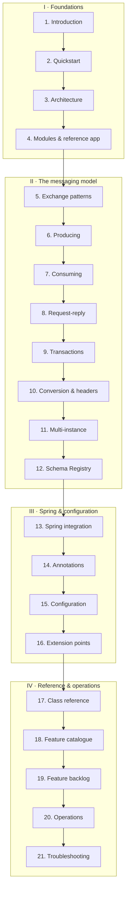

# solace-library documentation

A Spring integration library for **Solace PubSub+**, built directly on **JCSMP**, giving a Spring Boot
application the same programming model Spring for Apache Kafka gives a Kafka application:
`SolaceTemplate`, `ReplyingSolaceTemplate`, `@SolaceListener`, `@EnableSolace`, listener containers with
configurable concurrency, and Spring-managed Solace transactions.

The guides are numbered so that **reading order is learning order**. Each page ends with a link to the
next. If you only read three, read [1. Introduction](01-introduction.md),
[2. Quickstart](02-quickstart.md) and [5. Exchange patterns](05-exchange-patterns.md).

> **Module front page:** [`../README.md`](../README.md)  ·  **Reference-app guides:** [`client/README.md`](../../client/README.md) (requester), [`server/README.md`](../../server/README.md) (responder).

---

## Reading map

---

## Part I · Foundations

| Guide | What it covers |
| :--- | :--- |
| **[1. Introduction](01-introduction.md)** | What it is, why it exists, the Spring-for-Kafka mapping, the Solace concepts you need, and what it deliberately does not do |
| **[2. Quickstart](02-quickstart.md)** | Dependency, configuration, and complete working examples of all three patterns plus transactions |
| **[3. Architecture](03-architecture.md)** | Layers, the runtime object graph, startup/shutdown sequences, the send and receive paths, the threading model, session strategy |
| **[4. Modules & reference app](04-modules.md)** | The five Gradle modules, their dependencies and boundaries, and how the `client`/`server` demo is wired end to end |

## Part II · The messaging model

| Guide | What it covers |
| :--- | :--- |
| **[5. Exchange patterns](05-exchange-patterns.md)** | Publish-subscribe, point-to-point and request-reply: what each wires up, and how to choose |
| **[6. Producing messages](06-producing-messages.md)** | `SolaceTemplate`, delivery defaults, headers, the single/multiple/batch distinction, and queue browsing |
| **[7. Consuming messages](07-consuming-messages.md)** | Containers, endpoint naming, provisioning, concurrency, dispatch modes, settlement outcomes, delivery counts, flow events, tuning, topic dispatch, replay, the DMQ |
| **[8. Request-reply](08-request-reply.md)** | Correlation, per-instance reply destinations, timeouts, futures, and when to give a service its own reply endpoint |
| **[9. Transactions](09-transactions.md)** | Solace local transactions through `@Transactional` and `TransactionTemplate`, the transacted-session budget, and database interaction |
| **[10. Conversion and headers](10-conversion-and-headers.md)** | The converter and header-mapper SPIs, `SolaceHeaders`, `SolaceRecord`, and where the message body actually lives |
| **[11. Multi-instance](11-multi-instance.md)** | Instance ids, destination naming, session events, and what changes when you scale |
| **[12. Schema Registry](12-schema-registry.md)** | Avro, Protobuf and JSON Schema payloads governed by Apicurio Registry: formats, wire framing, artifact resolution, caching, and failure outcomes |

## Part III · Spring & configuration

| Guide | What it covers |
| :--- | :--- |
| **[13. Spring integration](13-spring-integration.md)** | Every framework contract the library implements: auto-configuration and its conditions, property binding, the `BeanPostProcessor`, listener method signatures, lifecycle phases, the transaction manager, and how to override any of it |
| **[14. Annotations](14-annotations.md)** | `@EnableSolace` and `@SolaceListener`, attribute by attribute, with worked declarations |
| **[15. Configuration reference](15-configuration.md)** | Every property, type, default and effect — plus precedence rules and environment-specific recipes |
| **[16. Extension points](16-extension-points.md)** | Every replaceable collaborator, with examples |

## Part IV · Reference & operations

| Guide | What it covers |
| :--- | :--- |
| **[17. Class reference](17-class-reference.md)** | Every public type, one table per package |
| **[18. Feature catalogue](18-features.md)** | Every implemented feature, what it does, where it is configured, and which doc explains it |
| **[19. Feature backlog](19-feature-backlog.md)** | Solace platform capabilities assessed against what is implemented, and what remains |
| **[20. Operations](20-operations.md)** | Logging, the Micrometer meters, the Actuator health indicator, sizing, deployment, and a pre-flight checklist |
| **[21. Troubleshooting](21-troubleshooting.md)** | Symptom → cause → fix, for everything that has actually gone wrong |

---

## The Spring for Kafka mapping

If you know Spring for Kafka, you already know this library's surface.

| Spring for Apache Kafka | This library |
| :--- | :--- |
| `@EnableKafka` / `@KafkaListener` | `@EnableSolace` (auto-applied) / `@SolaceListener` |
| `KafkaTemplate` / `ReplyingKafkaTemplate` | `SolaceTemplate` / `ReplyingSolaceTemplate` |
| `ProducerFactory` / `ConsumerFactory` | `SolaceSessionFactory` |
| `ConcurrentKafkaListenerContainerFactory` | `DefaultSolaceListenerContainerFactory` |
| `KafkaListenerEndpointRegistry` | `SolaceListenerEndpointRegistry` |
| `KafkaTransactionManager` | `SolaceTransactionManager` |
| `ConsumerRecord` / `ContainerProperties` | `SolaceRecord` / `ContainerProperties` |
| `spring.kafka.*` | `solace.*` |

Where the two differ, it is because Solace differs from Kafka — see
[1.2](01-introduction.md#12-the-spring-for-kafka-mapping).

---

**Next:** [1. Introduction](01-introduction.md)
