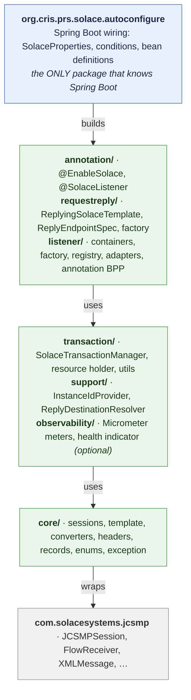
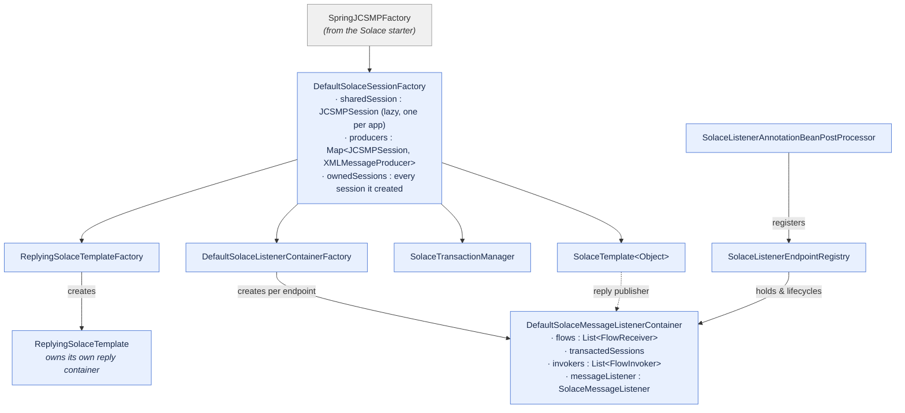
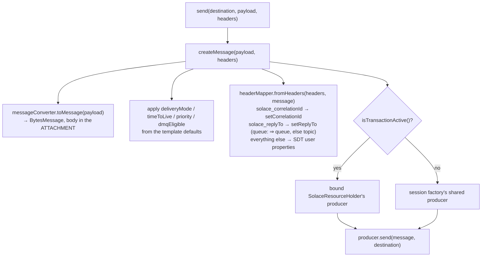
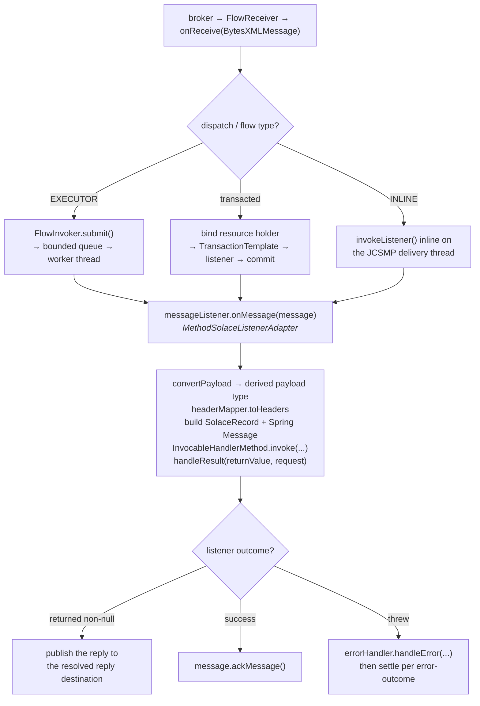

# 3. Architecture

---

## 3.1 Layers

The library is five packages, layered strictly downwards — nothing in a lower layer knows about a
higher one, and nothing anywhere knows about an application's domain types.



*Layers are strictly downward: nothing lower knows about anything higher, and nothing anywhere knows
about an application's domain types.*

Two structural rules are load-bearing:

1. **`org.cris.prs.solace.autoconfigure` is outside `cris.prs.messaging`.** An application that
   component-scans `cris.prs.messaging` must not pick the auto-configuration class up as an ordinary
   `@Configuration`; if it does, its conditions are evaluated before the Solace starter has
   contributed `SpringJCSMPFactory`, and every bean silently disappears. The package boundary is the
   guard. See [13.9](13-spring-integration.md#139-why-the-auto-configuration-package-is-separate).
2. **Only two packages touch anything outside core Spring.** The auto-configuration knows Spring
   Boot; `observability` knows Micrometer and Boot Actuator. Every bean in both is conditional, so an
   application without those dependencies is unaffected. Instrumentation reaches the message path
   through two plain interfaces (`SolaceListenerMetrics`, `SolaceRequestReplyMetrics`) that carry no
   metrics types at all.
3. **The library never depends on application types.** Payloads are `Object` at the library boundary
   and are converted by an SPI. There is no compile-time coupling to any DTO.

---

## 3.2 The object graph at runtime



`SolaceTemplate` and the containers share the session factory but not much else; the coupling
between sending and receiving is only that a listener's return value is published through a template.

---

## 3.3 Startup sequence

```
1.  Spring Boot starts.
2.  SolaceJavaAutoConfiguration  (Solace starter)  → SpringJCSMPFactory bean.
3.  SolaceAutoConfiguration  (@AutoConfiguration afterName = the above)
      · binds SolaceProperties from solace.*
      · registers the beans listed in 2.8, each @ConditionalOnMissingBean
      · @Import(SolaceAnnotationDrivenConfiguration) → @EnableSolace
          → @Import(SolaceBootstrapConfiguration)   → ImportBeanDefinitionRegistrar
              · registers SolaceListenerAnnotationBeanPostProcessor  (ROLE_INFRASTRUCTURE)
              · registers SolaceListenerEndpointRegistry             (ROLE_INFRASTRUCTURE)
4.  Singleton instantiation.
      · the BeanPostProcessor's postProcessAfterInitialization sees every bean and
        collects @SolaceListener methods.  It does NOT register containers yet.
5.  afterSingletonsInstantiated on the BeanPostProcessor:
      · builds a DefaultMessageHandlerMethodFactory
      · for each collected method: resolve placeholders → build SolaceListenerEndpoint
        → applyPatternDefaults() → derive the payload type → create an
        InvocableHandlerMethod → resolve the container factory → registry.register(...)
      · the registry asks the factory for a container and stores it by id
6.  SmartLifecycle start, in ascending phase order:
      · phase MAX-100  SolaceListenerEndpointRegistry  → starts every container
      · phase MAX-90   ReplyingSolaceTemplate          → starts its reply container
7.  The application is ready.
```

Step 4/5 being split is deliberate: registering containers from inside
`postProcessAfterInitialization` would force the container factory and the registry to be created
before the beans that depend on them, which produces circular-reference failures in real
applications. Deferring to `afterSingletonsInstantiated` means everything the registration needs is
guaranteed to exist.

Step 6's ordering is what makes request-reply safe. Responder containers are consuming before the
requester's template is allowed to send, so a reply can never arrive at a template whose correlation
map is not yet live.

### Container start, in detail

`DefaultSolaceMessageListenerContainer.start()` for a queue-based endpoint:

```
1.  Assert transactional-vs-transacted-session budget:
      concurrency <= solace.listener.max-transacted-sessions-per-connection
2.  Assert EXECUTOR dispatch has a task executor and is not combined with transactional=true
3.  DURABLE_QUEUE only:  provision the DMQ, then provision the queue
4.  NON_DURABLE_QUEUE:   session.createTemporaryQueue(name)   — not yet on the broker
5.  Create `concurrency` flows with startState=false
      · transactional → one TransactedSession per flow, on this container's OWN connection
      · otherwise     → CLIENT ack mode on the shared session
6.  Add every topic subscription to the queue
7.  Start the flows
8.  Acquire the keep-alive reference if solace.listener.keep-alive is true
```

The order of 4→5→6 is not negotiable. A temporary queue does not exist on the broker until a flow
binds to it, so subscribing first fails with `503 Unknown Queue`. Creating the flows *stopped* means
no message can be delivered in the window before the subscriptions are in place.

If any step throws, `releaseResources()` runs before the exception propagates, so a half-started
container never leaks flows or sessions for the life of the JVM.

---

## 3.4 The send path



`isTransactionActive()` is what decides between the two producers, and it consults
`TransactionSynchronizationManager` — so the same `send` call participates in an ambient
`@Transactional` scope or publishes immediately, with no API difference.

## 3.5 The receive path



### Reply destination resolution, in `handleResult`

In order, first match wins:

1. a `solace_targetDestination` header on a returned `Message<?>`;
2. the listener's configured `replyDestination`;
3. the request's `replyTo` field.

If none yields a destination the reply is logged and dropped — never thrown — because the *message*
was handled successfully and failing it would cause a pointless redelivery. The correlation id, and
the `instanceId` and `requestSendTime` user properties, are copied onto the reply so the requester
can match it and measure latency.

---

## 3.6 Threading model

| Thread | Created by | Daemon | What runs on it |
| :--- | :--- | :--- | :--- |
| `Context_N_ReactorThread-…` | JCSMP | yes | Message delivery; with `dispatch: INLINE` your listener runs here |
| `solace-<listenerId>-<n>` | `AsyncTaskExecutor`, one per flow | per executor | Your listener, with `dispatch: EXECUTOR` |
| `solace-reply-timeout` | `ReplyingSolaceTemplate` | yes | Fails futures whose reply never arrived |
| `solace-keep-alive` | `ContainerKeepAlive` | **no** | Nothing — it parks, so the JVM stays up |

**Every JCSMP thread is a daemon thread.** A listener-only application with no web server would
therefore start, register everything, and exit immediately. `ContainerKeepAlive` is a
reference-counted non-daemon thread — the first container that needs it starts it, the last one to
stop interrupts it — so the JVM lives exactly as long as there is something consuming.
`solace.listener.keep-alive` defaults to `true` and can be turned off for applications (like a
WebFlux service) that already have a non-daemon thread.

### Inline versus executor dispatch

`INLINE` runs the listener on the delivery thread. It is the default, it is the lowest-latency
option, and it is the only mode compatible with transactions.

`EXECUTOR` hands each message to a per-flow `FlowInvoker` over a bounded `LinkedBlockingQueue`
(`dispatch-queue-capacity`, default 256). `put` blocks, so a slow listener applies back-pressure
through the delivery thread to the broker's transport window rather than filling the heap. On stop
the invoker drains what it has buffered, then gives up after `shutdown-timeout` and interrupts.

`EXECUTOR` + `transactional=true` is rejected at startup with an explanatory `IllegalStateException`.
A transacted session's `commit()` acknowledges *every* message delivered on that session so far, not
just the one in hand — so buffering messages away from the delivery thread would let a commit cover
messages that have not been processed, and a rollback redeliver ones that have. Transacted flows
stay strictly inline.

---

## 3.7 Session and connection strategy

`DefaultSolaceSessionFactory` holds one lazily-created **shared session** used by the template, by
non-transactional flows, and by all provisioning. Two things force extra connections:

- **Transactional containers.** Solace caps transacted sessions per *client connection* (10 by
  default). Two transactional containers at concurrency 10 and 5 would need 15 between them, which
  no single connection will give. Each transactional container therefore opens its own
  `JCSMPSession` via `createSession()` and takes its transacted sessions from that. The container
  also asserts `concurrency <= max-transacted-sessions-per-connection` at startup so the failure is
  a clear message rather than a broker 503.
- **The default-publisher rule.** JCSMP refuses to create additional publisher flows on a session
  until that session's default publisher exists. `createTransactedSession(session)` therefore calls
  `getProducer(session)` first. Producers are cached per session in a `ConcurrentHashMap`, so the
  rule is satisfied once per connection.

Every session the factory creates is tracked in `ownedSessions` and closed in `destroy()`.

**Session events.** Sessions are created through `SpringJCSMPFactory.createSession(null, handler)` —
the no-argument overload is exactly `createSession(null, null)`, so passing a handler costs nothing
and is the only way to observe a reconnect. JCSMP repairs a dropped connection transparently, and
flows that survive it raise no flow event, so without this a network blip that stops all traffic for
seconds leaves no trace anywhere. The factory tracks a `SolaceSessionState` from those events, which
is what the health indicator reports and what `solace.session.state` gauges. See
[11.7](11-multi-instance.md) and [20.3](20-operations.md#203-actuator-health).

---

## 3.8 Shutdown

```
1.  SmartLifecycle stop, descending phase:
      · ReplyingSolaceTemplate  → stop reply container, shut the timeout scheduler,
                                  fail every outstanding future with a timeout exception
      · SolaceListenerEndpointRegistry → stop every container
2.  Each container: stop and close flows → close transacted sessions → close the direct
      consumer → close its own session → release the keep-alive reference
3.  DefaultSolaceSessionFactory.destroy() closes every session it created
4.  The keep-alive thread's count reaches zero, it is interrupted, the JVM exits
```

Failing outstanding futures on stop is deliberate: leaving callers blocked on replies that can no
longer arrive turns a clean shutdown into a hang.

---

**Previous:** [2. Quickstart](02-quickstart.md)  ·  [Index](00-index.md)  ·  **Next:** [4. Modules & reference app](04-modules.md)
