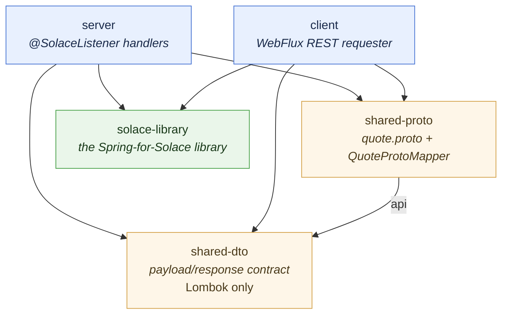
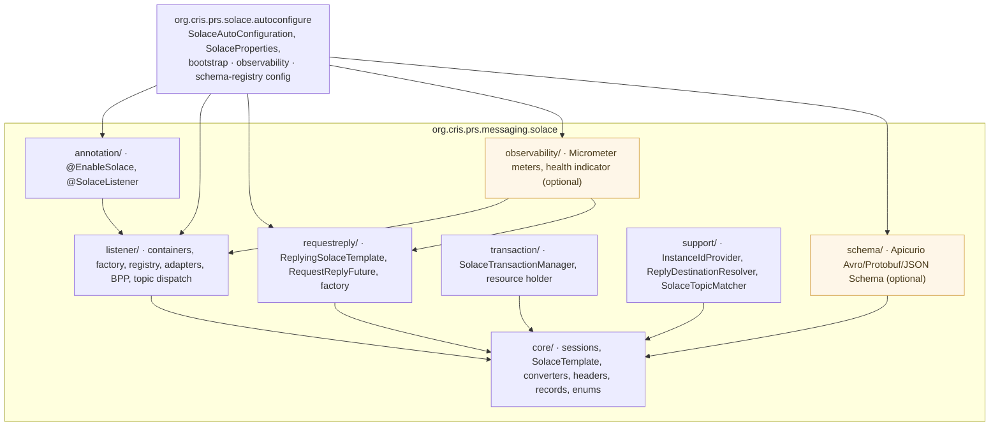
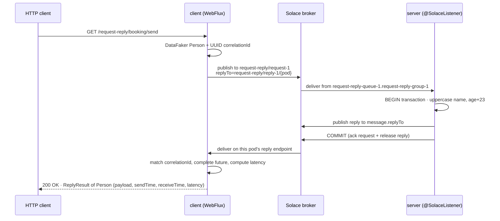

# 4. Modules & reference app

The repository is a Gradle multi-module build. `solace-library` is the reusable piece; the other four
modules are a worked reference application that exercises every pattern the library supports. This page
documents each module — what it contains, what it depends on, and the boundaries that are deliberately
enforced — and then walks the demo end to end.

---

## 4.1 The module graph



Two dependency rules are load-bearing and enforced by review:

1. **`solace-library` depends on neither `shared-dto` nor `shared-proto`.** The library never sees an
   application payload type; payloads are `Object` at its boundary and converted by an SPI. This is
   what keeps it reusable in any application.
2. **`shared-dto` depends on nothing but Lombok.** No Solace, Spring Messaging or web types leak into
   the client/server contract.

| Module | Gradle path | Role | Key dependencies |
| :--- | :--- | :--- | :--- |
| [`shared-dto`](#42-shared-dto) | `:shared-dto` | The client/server data contract | Lombok only |
| [`shared-proto`](#43-shared-proto) | `:shared-proto` | The Protobuf demo contract | `api project(':shared-dto')`, protobuf-java |
| [`solace-library`](#44-solace-library) | `:solace-library` | The Spring-for-Solace library | Solace starter, Spring Messaging/Tx, Jackson, Actuator, Micrometer; Apicurio serdes `compileOnly` |
| [`client`](#45-client) | `:client` | WebFlux REST requester | `solace-library`, `shared-dto`, `shared-proto`, WebFlux, Apicurio serdes |
| [`server`](#46-server) | `:server` | `@SolaceListener` responders | `solace-library`, `shared-dto`, `shared-proto`, WebFlux, Apicurio serdes |

---

## 4.2 `shared-dto`

The payload and response contract shared by `client` and `server`, in package `cris.prs.messaging`.

| Type | Purpose |
| :--- | :--- |
| `Person` | The publish-subscribe / booking / quote request-and-reply payload |
| `Notification` | Broadcast payload for publish-subscribe |
| `Task` | Work-queue payload for point-to-point |
| `Quote` | The quote services' reply type |
| `InventoryCheck` / `InventoryStatus` | The inventory service's request and reply types |
| `ReplyResult<T>` | The REST envelope: `payload`, `sendTime`, `receiveTime`, `latency` |

It also carries `src/main/resources/schemas/*.json` — the hand-written **draft-07 JSON Schemas** for
`Person` and `Quote`. They are *data, not code*, so the Lombok-only rule still holds; they live here
because both applications need them (see [12. Schema Registry](12-schema-registry.md)). A test keeps the
schemas in step with the DTOs field for field, so the classes cannot drift from the registered contract.

**Constraint:** never add a dependency here, and never make `solace-library` depend on this module.

---

## 4.3 `shared-proto`

The Protobuf demo's contract: `src/main/proto/quote.proto` (messages `QuoteRequest`, `QuoteReply`) plus
`QuoteProtoMapper`, which maps to and from the `shared-dto` types. It exists so that `shared-dto` can stay
Lombok-only: Protobuf needs generated message classes, which would otherwise pull a code-generation
dependency into the pure contract module. `shared-proto` depends on `shared-dto` via `api`, and holds the
generated Protobuf classes used by the Protobuf schema-registry demo.

---

## 4.4 `solace-library`

The reusable library. Package root `org.cris.prs.messaging.solace`, with the Spring Boot
auto-configuration deliberately outside it in `org.cris.prs.solace.autoconfigure`
(see [13.9](13-spring-integration.md#139-why-the-auto-configuration-package-is-separate)).



| Package | Contains | Full detail |
| :--- | :--- | :--- |
| `core/` | `SolaceSessionFactory`, `SolaceTemplate`, converters, header mapping, `SolaceRecord`, `SolaceBrowser`, enums (`EndpointMode`, `ExchangePattern`, `SettlementOutcome`, `SolaceSessionState`, …) | [6](06-producing-messages.md), [10](10-conversion-and-headers.md), [17.1](17-class-reference.md#171-core--sessions-sending-conversion) |
| `listener/` | Listener container, container factory, endpoint registry, the annotation `BeanPostProcessor`, adapters, `ContainerKeepAlive`, topic dispatch | [7](07-consuming-messages.md), [17.2](17-class-reference.md#172-listener--consuming) |
| `requestreply/` | `ReplyingSolaceTemplate`, `RequestReplyFuture` (carries `sendTime`/`receiveTime`/`latency`), `ReplyEndpointSpec`, `ReplyingSolaceTemplateFactory` | [8](08-request-reply.md), [17.3](17-class-reference.md#173-requestreply) |
| `transaction/` | `SolaceTransactionManager` (JCSMP `TransactedSession`), `SolaceResourceHolder`, `SolaceTransactionUtils` | [9](09-transactions.md), [17.4](17-class-reference.md#174-transaction) |
| `support/` | `HostnameInstanceIdProvider`, `ReplyDestinationResolver`, `SolaceTopicMatcher` | [11](11-multi-instance.md), [17.6](17-class-reference.md#176-support) |
| `observability/` | Micrometer meters, the Actuator health indicator, session statistics. **The only package touching Micrometer/Actuator**; every bean conditional | [20.2](20-operations.md#202-micrometer-metrics), [17.5](17-class-reference.md#175-observability--optional-micrometer-and-actuator-integration) |
| `schema/` | Apicurio Registry support (Avro, Protobuf, JSON Schema): registry converter, `SchemaCodec` seam, codecs, topic-profile strategy, registrar. **The only package importing `io.apicurio`/Avro/Protobuf**; Apicurio jars are `compileOnly` | [12](12-schema-registry.md), [17.5a](17-class-reference.md#175a-schema--optional-apicurio-registry-integration-avro-protobuf-json-schema) |
| `annotation/` | `@EnableSolace`, `@SolaceListener` | [14](14-annotations.md) |
| `org.cris.prs.solace.autoconfigure` | Auto-configuration, `SolaceProperties`, bootstrap / observability / schema-registry configs — **outside `cris.prs.messaging`** on purpose | [13](13-spring-integration.md), [15](15-configuration.md) |

**Library purity rules.** No `Person`, `booking`, or other client/server concept appears in
`solace-library` sources, javadoc or examples — neutral names (`orders/place`, `app/reply`) are used
throughout. The library stays generic so it can be extracted and published on its own.

---

## 4.5 `client`

> **Full module guide:** [`client/README.md`](../../client/README.md).

A Spring WebFlux service that originates every request and exposes one REST controller per exchange
pattern, each offering the same three verbs — **single**, **multiple** (N independent publishes) and
**batch** (N publishes in one Solace transaction).

| Controller | Base path | Pattern |
| :--- | :--- | :--- |
| `PublishSubscribeRestService` | `/pub-sub` | publish-subscribe |
| `PointToPointRestService` | `/point-to-point` | point-to-point |
| `RequestReplyRestService` | `/request-reply` | request-reply (booking, quote, inventory) |
| `SchemaRegistryRestService` | `/request-reply/quote-*` | request-reply governed by Apicurio (Avro / Protobuf / JSON Schema) |
| `AdminRestService` | `/admin` | operator endpoints: queue depth, peek, DMQ peek, containers, replay |
| `HealthRestService` | `/test` | health check |

Producers: `NotificationPublisher`, `TaskDispatcher`, `BookingRequestService`,
`Quote{,Avro,Protobuf,JsonSchema}RequestService`, `InventoryRequestService`. `PersonFactory` /
`InventoryCheckFactory` supply identical sample payloads across patterns. `AppConfig` exposes a
`TransactionTemplate` over the auto-configured `SolaceTransactionManager`, and declares
`inventoryReplyingSolaceTemplate` plus the three governed reply templates.

There is **no reply-consumer class** in `client`: the reply container is auto-configured and owned by
`ReplyingSolaceTemplate`. Each governed demo and the inventory service get their **own** reply
destination via a `ReplyEndpointSpec`; every other exchange shares the per-instance reply destination
(the correlation id separates conversations — see
[8.6](08-request-reply.md#86-when-to-split-a-reply-destination)).

---

## 4.6 `server`

> **Full module guide:** [`server/README.md`](../../server/README.md).

The responder: `@SolaceListener` handlers, one per exchange, with `App` and `AppConfig` for wiring. A
transactional durable listener; request-reply origination is disabled (`solace.request-reply.enabled:
false`), because the server never sends requests.

| Listener | Pattern | Endpoint / topic |
| :--- | :--- | :--- |
| `ServiceConsumer.booking` | `REQUEST_REPLY` | `request-reply-queue-1.request-reply-group-1`, topic `request-reply/request-1` → `Person` |
| `QuoteConsumer.quote` | `REQUEST_REPLY` | `…queue-2.…group-2`, topic `request-reply/request-2` → `Quote` |
| `InventoryConsumer.check` | `REQUEST_REPLY` | `…queue-3.…group-3`, topic `request-reply/request-3` → `InventoryStatus` |
| `QuoteAvroConsumer.quote` | `REQUEST_REPLY` | `…queue-4.…group-4`, topic `request-reply/quote-avro/request`; `Person`→`Quote` as **Avro** |
| `QuoteProtobufConsumer.quote` | `REQUEST_REPLY` | `…queue-5.…group-5`, topic `request-reply/quote-protobuf/request`; `QuoteRequest`→`QuoteReply` as **Protobuf** |
| `QuoteJsonSchemaConsumer.quote` | `REQUEST_REPLY` | `…queue-6.…group-6`, topic `request-reply/quote-jsonschema/request`; `Person`→`Quote` as **schema-validated JSON** |
| `NotificationSubscriber.onNotification` | `PUBLISH_SUBSCRIBE` | `notification.<instance-id>`, topic `notification/broadcast` |
| `NotificationRouter` (3 methods) | `POINT_TO_POINT` | `notification-router.v1`, one endpoint via topic dispatch |
| `TaskWorker.onTask` | `POINT_TO_POINT` | `task.workers`, topic `task/submit`; takes `SolaceRecord` for the delivery count |

Every request-reply listener returns a value that the container publishes to the request's `replyTo`;
all three quote/inventory/booking containers are transactional, so ack and reply commit together.
`QuotePricing` holds the pricing logic shared by all four quote services.

**A second request-reply service needs its own request *topic*, not just its own queue.** Two queues on
one topic each receive every request → both answer → the requester gets one reply plus one orphan. The
services share the client's single per-instance reply destination.

---

## 4.7 The demo, end to end



**Running it** (from the repository root):

```bash
skaffold dev                                        # build images, deploy, stream logs
kubectl port-forward svc/client 8080:80 -n anupam
```

```bash
curl "http://localhost:8080/pub-sub/publish?message=deploy+finished"    # fan-out: every server pod
curl "http://localhost:8080/point-to-point/submit?description=reindex"  # work queue: one pod
curl "http://localhost:8080/request-reply/booking/send"                 # RPC: Person in, Person out
curl "http://localhost:8080/request-reply/quote-avro/send"              # quote, as Avro via Apicurio
```

**Proving the patterns differ** — scale the server and watch the logs:

```bash
kubectl scale deployment/server --replicas=3 -n anupam
kubectl logs -l app=server -n anupam --tail=50 | grep -E "Notification|Task"
```

One notification appears in **all three** pods' logs; one task appears in **exactly one**. That
distinction is pinned by `server`'s `ExchangePatternConfigurationTest`
([5. Exchange patterns](05-exchange-patterns.md)).

---

## 4.8 Deployment modules

| Path | Purpose |
| :--- | :--- |
| `k8s-solace-deployment/` | Solace PubSub+ broker, MetalLB load balancer and Ingress manifests |
| `client/k8s/`, `server/k8s/` | Deployment manifests (the client declares `POD_NAME` via the Downward API) |
| `skaffold.yaml`, `skaffold.env` | Build/deploy loop; images built with Google Jib |
| `gradle.properties` | `container_registry=quay.prs`, read via `project.findProperty('container_registry')` |

---

**Previous:** [3. Architecture](03-architecture.md)  ·  [Index](00-index.md)  ·  **Next:** [5. Exchange patterns](05-exchange-patterns.md)
