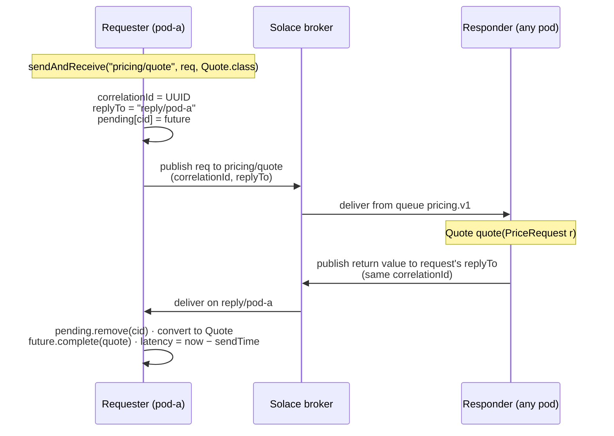

# 8. Request-reply

The counterpart of `ReplyingKafkaTemplate`, with the multi-instance problem solved by construction.

---

## 8.1 The shape of it



Two invariants make this safe:

- **The requester owns the reply channel.** It creates the reply destination, consumes it, and puts
  its name in every request. The responder only echoes `replyTo` — it never chooses.
- **The correlation id demultiplexes.** One reply destination can serve any number of concurrent
  requests to any number of services.

---

## 8.2 The requester

```java
@Service
public class PricingClient {

    private final ReplyingSolaceTemplate solace;

    public PricingClient(ReplyingSolaceTemplate solace) {
        this.solace = solace;
    }

    public Mono<Quote> quote(PriceRequest request) {
        RequestReplyFuture<Quote> future =
                solace.sendAndReceive("pricing/quote", request, Quote.class);
        return Mono.fromFuture(future);
    }
}
```

Three overloads:

```java
<T> RequestReplyFuture<T> sendAndReceive(String destination, Object payload, Class<T> replyType);

<T> RequestReplyFuture<T> sendAndReceive(String destination, Object payload, Class<T> replyType,
                                         Duration replyTimeout);

<T> RequestReplyFuture<T> sendAndReceive(String destination, Object payload,
                                         Map<String,Object> headers, Class<T> replyType,
                                         Duration replyTimeout);
```

A `null` timeout uses `solace.request-reply.reply-timeout`; zero or negative waits indefinitely.

Each call:

1. generates a correlation id and records `sendTime`;
2. stamps the request with `solace_correlationId`, `solace_replyTo`, `requestSendTime` and
   `instanceId`;
3. registers the future in the pending map **before** publishing;
4. publishes, and schedules the timeout;
5. returns immediately.

A publish failure **completes the future exceptionally** rather than throwing, so a caller has one
place to handle every failure mode. `sendAndReceive` on a stopped template throws
`IllegalStateException` — that is a programming error, not a message failure.

## 8.3 `RequestReplyFuture<R>`

Extends `CompletableFuture<R>`, so everything you know applies — `thenApply`, `orTimeout`,
`Mono.fromFuture`, `join`. It additionally carries:

| Accessor | Meaning |
| :--- | :--- |
| `getCorrelationId()` | The id used to match the reply |
| `getRequestDestination()` | Where the request went |
| `getReplyDestination()` | Where the reply is expected |
| `getSendTime()` | Epoch millis at publish |
| `getReceiveTime()` | Epoch millis at reply, `0` until then |
| `getLatency()` | `receiveTime - sendTime`, or `-1` if no reply yet |

`getLatency()` is per-request round-trip time measured by the requester, which makes it the honest
number to report.

## 8.4 The responder

```java
@SolaceListener(pattern = "REQUEST_REPLY", queue = "pricing", group = "v1",
        topics = "pricing/quote", concurrency = "5", transactional = "true")
public Quote quote(PriceRequest request) {
    return new Quote(request.sku(), price(request));
}
```

That is the whole opt-in: **return a value**. No output binding, no reply topic, no template.

- `transactional = "true"` makes the acknowledgement and the reply commit together, so a crash after
  processing but before the reply is published redelivers the request rather than losing it.
- Leave `replyDestination` unset. Setting it overrides the requester's `replyTo` and breaks the
  ownership invariant; it exists for the unusual case of routing every response to a fixed sink.

To control the reply's headers, return a `Message<?>`:

```java
public Message<Quote> quote(PriceRequest request) {
    return MessageBuilder.withPayload(new Quote(...))
            .setHeader("pricingVersion", "v2")
            .build();
}
```

A `solace_targetDestination` header on that message overrides the reply destination for that one
reply.

---

## 8.5 Multi-instance handling

The reply destination is `<reply-topic-prefix>/<sanitised instance id>`:

```yaml
solace:
  request-reply:
    reply-topic-prefix: reply
    append-instance-id: true      # default
```

```
pod orders-api-7d9f8c-x2k4l   →   reply/orders-api-7d9f8c-x2k4l
pod orders-api-7d9f8c-p8m2n   →   reply/orders-api-7d9f8c-p8m2n
```

Each pod consumes only its own destination, so a reply always lands on the pod that asked — which is
the pod holding the `CompletableFuture` the caller is waiting on. Without this, a reply could be
delivered to a sibling pod that has never heard of the correlation id, and the original caller would
time out. The reply endpoint is a temporary queue, so it disappears with the pod and nothing
accumulates.

The instance id comes from `InstanceIdProvider` — see [11. Multi-instance](11-multi-instance.md).

Turn `append-instance-id` off only for a *shared durable* reply endpoint, where replies are
load-balanced across instances. That requires correlation state visible to every instance, which this
library does not provide.

---

## 8.6 When to split a reply destination

**By default, every service an application calls should share its one per-instance reply
destination.** The reply channel belongs to the requester, the correlation id keeps conversations
apart, and one endpoint per pod beats pods × services in endpoint count, bind count and
provisioning churn.

Four conditions justify a separate one:

| Condition | Why it matters |
| :--- | :--- |
| **Head-of-line blocking** | One service's replies delay a latency-sensitive service's on the shared flow. Acute at `concurrency: 1`, which is the only option on a non-durable endpoint. |
| **Different trust domains** | A destination consumed by one service only can be given a narrower ACL. |
| **Blast radius** | A stuck or flooded reply flow then affects one service instead of all of them. |
| **Observability** | Per-service reply depth and rate become separate broker-side metrics. |

A fifth applies with a schema registry: a shared reply destination carries several reply types, and no
single topic-to-artifact mapping fits them all (Avro's `RECORD` strategy is the exception). See
[12.5](12-schema-registry.md#125-where-the-schema-comes-from-artifact-resolution). Whatever the reason,
map a reply destination in `solace.schema-registry.topic-profile` by its **prefix with `>`**, never by
the resolved per-instance topic.

### How

```java
@Bean
ReplyingSolaceTemplate inventoryReplyingSolaceTemplate(
        ReplyingSolaceTemplateFactory factory,
        @Value("${app.inventory.reply-topic-prefix:reply/inventory}") String replyTopicPrefix,
        @Value("${app.inventory.reply-timeout:30s}") Duration replyTimeout) {

    ReplyEndpointSpec spec = new ReplyEndpointSpec();
    spec.setId("inventoryReplyContainer");          // must be unique
    spec.setReplyTopicPrefix(replyTopicPrefix);
    spec.setAppendInstanceId(true);
    spec.setEndpointMode(EndpointMode.NON_DURABLE_QUEUE);
    spec.setReplyTimeout(replyTimeout);
    return factory.create(spec);
}
```

The factory builds the template *and* its reply container. The returned bean is a `SmartLifecycle`,
so Spring starts and stops it with everything else.

**Two consequences to plan for:**

1. There are now two `ReplyingSolaceTemplate` beans, so **every injection point needs a
   `@Qualifier`**. The auto-configured one is named `replyingSolaceTemplate`.
   ```java
   public BookingService(@Qualifier("replyingSolaceTemplate") ReplyingSolaceTemplate solace) { … }
   public InventoryService(@Qualifier("inventoryReplyingSolaceTemplate") ReplyingSolaceTemplate solace) { … }
   ```
2. **Nothing changes on the responder.** It still echoes `replyTo`. A listener's `replyDestination`
   stays empty; the requester's choice of template is what decides where the reply goes.

### `ReplyEndpointSpec`

`SolaceProperties.RequestReply extends ReplyEndpointSpec`, so a YAML-configured reply destination and
a hand-built one are described by the same object.

| Property | Default | Meaning |
| :--- | :--- | :--- |
| `id` | `solaceReplyContainer` | Reply container id; must be unique per destination |
| `replyTopicPrefix` | `reply` | Base of the reply topic |
| `appendInstanceId` | `true` | Make the destination private to this instance |
| `endpointMode` | `NON_DURABLE_QUEUE` | Temporary is right for per-instance |
| `replyQueue` | prefix with `/` → `.` | Endpoint name backing the topic |
| `replyGroup` | — | For a shared durable reply endpoint |
| `selector` | — | Broker-side filter on the reply endpoint |
| `concurrency` | `1` | Only meaningful with `DURABLE_QUEUE`; clamped to 1 otherwise |
| `replyTimeout` | `30s` | Default wait before the future fails |
| `deliveryMode` | `PERSISTENT` | Delivery mode for **requests** sent through this template |
| `timeToLive` | inherits `solace.template.time-to-live` | Expiry in ms for **requests**; `0` never expires |
| `priority` | inherits `solace.template.priority` | Priority for requests |
| `dmqEligible` | inherits `solace.template.dmq-eligible` | Move expired or undeliverable requests to the DMQ |

The last three are unset by default and fall back to `solace.template.*`, so a reply template an
application declares publishes the same way the auto-configured `solaceTemplate` does. Stating one on
the spec wins over the fallback — including `timeToLive: 0`, which switches expiry off where the
template defaults set one.

**Give requests an expiry.** A request is persistent and its endpoint is durable, which is the point —
but it means the request outlives the responder. Restart the server mid-flight and the request waits on
the queue, is handled whenever the server comes back, and the reply arrives to a requester that gave up
minutes ago (8.7). Setting `timeToLive` to the reply timeout makes the two agree: the broker stops
delivering a request at the moment its requester stops waiting. It only takes effect on an endpoint
provisioned with `respects-ttl` ([9](07-consuming-messages.md)); with `dmqEligible` on, the expired
request lands on the dead message queue where it can be inspected rather than vanishing.

---

## 8.7 Timeouts

A single-threaded daemon scheduler (`solace-reply-timeout`) fails futures whose replies never arrive:

```java
RequestReplyFuture<Quote> future =
        solace.sendAndReceive("pricing/quote", request, Quote.class, Duration.ofSeconds(5));

future.exceptionally(ex -> {
    if (ex.getCause() instanceof SolaceReplyTimeoutException) { … }
    return fallback();
});
```

The scheduled task is cancelled as soon as the future completes, so it costs nothing on the happy
path. A reply arriving *after* its timeout finds no pending entry and is logged as
`Received a reply with no outstanding request` — the normal signature of a late responder, and the
first thing to look for when that warning appears in volume.

When that warning follows a `SolaceReplyTimeoutException` for the *same* correlation id, the usual
cause is not a slow responder but an absent one: the request sat on its durable queue with nothing
bound to it, and was delivered the moment a listener started. Compare the responder's start-up log with
the request's timestamp. The fix is an expiry on requests (`timeToLive` in 8.6), so the broker stops
delivering a request once its requester has stopped waiting.

On `stop()`, every outstanding future is failed with `SolaceReplyTimeoutException`. Leaving callers
blocked on replies that can no longer arrive would turn shutdown into a hang.

---

## 8.8 Concurrency and throughput

`sendAndReceive` never blocks. Concurrency is bounded by how many futures you keep outstanding:

```java
Flux.range(0, 10_000)
    .flatMap(i -> Mono.fromFuture(solace.sendAndReceive("pricing/quote", request(i), Quote.class)),
             256)                                   // 256 in flight
    .collectList();
```

`getPendingCount()` is the outstanding-request count — the single most useful metric on this class.
A number that grows without bound means replies are not being matched: a wrong reply destination, a
responder that is not returning a value, or timeouts firing faster than replies arrive.

Reply-side throughput on a per-instance temporary endpoint is one flow. If that becomes the
bottleneck, the options in order of preference are: run more instances, split the reply destination
per service, or move to a shared durable reply endpoint with higher `concurrency` — the last of which
means giving up per-instance ownership.

---

## 8.9 Correlating by hand

You do not have to use `ReplyingSolaceTemplate`. A plain template plus a listener works when the
reply arrives much later — a saga step, an approval:

```java
solace.send("payments/authorise", request, Map.of(
        SolaceHeaders.CORRELATION_ID, sagaId,
        SolaceHeaders.REPLY_TO,       "queue:payment-callbacks"));
```

```java
@SolaceListener(pattern = "POINT_TO_POINT", queue = "payment-callbacks", group = "v1")
public void onAuthorised(AuthResult result,
                         @Header(SolaceHeaders.CORRELATION_ID) String sagaId) {
    sagaRepository.advance(sagaId, result);
}
```

Note the reply destination here is a **durable queue**, so a callback that arrives after a restart is
still waiting. That is the trade the in-memory correlation of `ReplyingSolaceTemplate` cannot make.

---

**Previous:** [7. Consuming messages](07-consuming-messages.md)  ·  [Index](00-index.md)  ·  **Next:** [9. Transactions](09-transactions.md)
