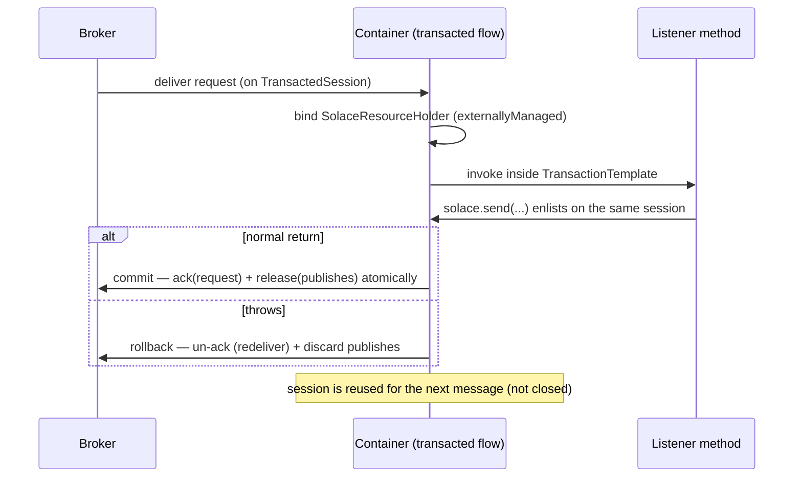

# 9. Transactions

Solace **local** transactions, exposed as a Spring `PlatformTransactionManager`, so `@Transactional`
and `TransactionTemplate` work the way they do everywhere else.

---

## 9.1 What a Solace local transaction is

A `TransactedSession` is a JCSMP scope in which consumes and publishes accumulate until `commit()` or
`rollback()`.

- **Commit** acknowledges every message consumed on that session since the last commit, *and*
  releases every message published on it to the broker. Both, atomically, from the broker's point of
  view.
- **Rollback** un-acknowledges the consumed messages — the broker redelivers them — and discards the
  published ones.

That last point is what makes a transacted listener useful: process-and-publish becomes all-or-nothing
without any deduplication logic in the consumer.

**Two hard limits:**

1. **No XA.** JCSMP supports local transactions only. A Solace transaction and a JDBC transaction in
   the same method are two independent transactions that commit separately. If the second commit
   fails, the first has already happened.
2. **A per-connection budget.** A broker allows a fixed number of transacted sessions per client
   connection — 10 by default. See [9.6](#96-the-transacted-session-budget).

---

## 9.2 The Spring pieces

| Type | Role |
| :--- | :--- |
| `SolaceTransactionManager` | `AbstractPlatformTransactionManager` + `ResourceTransactionManager`. Drives begin/commit/rollback. |
| `SolaceResourceHolder` | `ResourceHolderSupport` wrapping one `TransactedSession` and its producer. Thread-bound. |
| `SolaceTransactionUtils` | Bind/unbind/lookup helpers over `TransactionSynchronizationManager`. |

Resources are keyed by the `SolaceSessionFactory` (that is what `getResourceFactory()` returns), so
Solace transactions are independent of any `DataSource` transaction bound to the same thread.

| Template method | Behaviour |
| :--- | :--- |
| `doGetTransaction()` | Wraps the currently bound holder, if any |
| `isExistingTransaction()` | True when a holder is bound and active — supports `PROPAGATION_REQUIRED` |
| `doBegin()` | Creates a `TransactedSession`, wraps it, binds it to the thread |
| `doCommit()` / `doRollback()` | Delegate to the session |
| `doSetRollbackOnly()` | Marks the holder |
| `doCleanupAfterCompletion()` | Unbinds; closes the session **unless it is externally managed** |

---

## 9.3 Producer-side transactions

### `@Transactional`

```java
@Service
public class OrderPublisher {

    private final SolaceTemplate<Object> solace;

    @Transactional("solaceTransactionManager")
    public void publishAll(List<Order> orders) {
        orders.forEach(order -> solace.send("orders/created", order));
    }   // one commit; consumers see all of them or none
}
```

If only one transaction manager exists, the qualifier is optional. Name it whenever a `DataSource`
transaction manager is also present, or Spring picks the wrong one.

### `TransactionTemplate`

```java
@Bean
TransactionTemplate transactionTemplate(SolaceTransactionManager transactionManager) {
    return new TransactionTemplate(transactionManager);
}

transactionTemplate.executeWithoutResult(status ->
        orders.forEach(order -> solace.send("orders/created", order)));
```

### `executeInTransaction`

```java
solace.executeInTransaction(operations -> {
    operations.send("orders/created", order);
    operations.send("audit/order", audit(order));
    return null;
});
```

If a transaction is already bound to the thread the callback simply runs inside it — it does not open
a nested one.

### How the template knows

`SolaceTemplate.producer()` asks `isTransactionActive()`, which consults
`TransactionSynchronizationManager` for a bound `SolaceResourceHolder`:

```java
protected XMLMessageProducer producer() {
    SolaceResourceHolder holder = SolaceTransactionUtils.getActiveResourceHolder(sessionFactory);
    return holder != null ? holder.getProducer() : sessionFactory.getSharedProducer();
}
```

So the identical `send` call publishes immediately or enlists, with no API difference and nothing for
the caller to remember.

---

## 9.4 Consumer-side transactions

```java
@SolaceListener(pattern = "POINT_TO_POINT", queue = "orders", group = "workers",
        topics = "orders/created", transactional = "true", concurrency = "5")
public void onOrder(Order order) {
    solace.send("orders/audited", audit(order));    // same transaction as the acknowledgement
}                                                   // throw here and both roll back
```



Mechanically:

- each flow gets its **own** `TransactedSession` (so `concurrency: 5` means five of them);
- the flow is created *on* that session, which is why the container must own it;
- before invoking the listener the container binds a `SolaceResourceHolder` marked
  **`externallyManaged = true`** and runs the listener inside a `TransactionTemplate`;
- on normal return the manager commits — acknowledgement and reply together;
- on exception it rolls back, the broker redelivers, and the error handler is called afterwards for
  logging;
- `doCleanupAfterCompletion` unbinds but does **not** close the session, because the container owns
  it and will reuse it for the next message.

`ack-on-error` does not apply to a transacted flow: the rollback governs redelivery.

### Request-reply, transactionally

This is the case that most justifies the feature:

```java
@SolaceListener(pattern = "REQUEST_REPLY", queue = "pricing", group = "v1",
        topics = "pricing/quote", transactional = "true")
public Quote quote(PriceRequest request) {
    return new Quote(request.sku(), price(request));
}
```

The container publishes the returned value on the same transacted session that will acknowledge the
request. A crash between processing and reply therefore redelivers the request instead of losing the
response.

---

## 9.5 Interaction with a database

```java
@Transactional                                   // JDBC
public void handle(Order order) {
    orderRepository.save(order);
    solace.send("orders/created", order);        // NOT in the JDBC transaction
}
```

The `send` publishes immediately — there is no Solace transaction bound, and JDBC's is a different
resource. If the database transaction then rolls back, the message has already gone.

Nesting both does not make them atomic either:

```java
@Transactional                                   // JDBC
public void handle(Order order) {
    orderRepository.save(order);
    transactionTemplate.executeWithoutResult(status ->
            solace.send("orders/created", order));   // commits BEFORE the JDBC commit
}
```

**There is no XA to fix this.** The options are the standard ones:

| Approach | Trade-off |
| :--- | :--- |
| **Transactional outbox** | Write the message to a table in the JDBC transaction; a separate poller publishes it. Genuinely atomic, at the cost of a poller and at-least-once delivery. |
| **Publish after commit** | `TransactionSynchronizationManager.registerSynchronization(...)` with an `afterCommit` callback. Simple; loses the message if the publish fails after the commit. |
| **Idempotent consumers** | Publish first, accept duplicates, deduplicate downstream. Usually the cheapest correct answer. |

---

## 9.6 The transacted session budget

Solace caps transacted sessions **per client connection** — 10 by default, set in the client profile.
A transactional container needs one per flow, so two containers at concurrency 10 and 5 need 15
between them, which no single connection will give.

The library handles this in two ways:

1. **Each transactional container opens its own `JCSMPSession`.** The budget is therefore per
   container, not shared across the whole application.
2. **A startup assertion.** A container whose `concurrency` exceeds
   `solace.listener.max-transacted-sessions-per-connection` refuses to start, with a message naming
   the container and both numbers — instead of failing later with
   `503 Max Transacted Sessions Exceeded`.

```yaml
solace:
  listener:
    max-transacted-sessions-per-connection: 10   # must match the broker's client profile
```

Raise the broker limit *and* this property together, or lower the concurrency.

There is a third, subtler rule the session factory handles for you: **JCSMP refuses to create
additional publisher flows on a session until that session's default publisher exists.**
`createTransactedSession(session)` therefore creates the session's producer first. Producers are
cached per session, so this costs one call per connection.

---

## 9.7 What not to do

**`EXECUTOR` dispatch with `transactional = true`** — rejected at startup. A transacted session's
commit acknowledges every message delivered on it so far, not just the one in hand; buffering
messages onto another thread would let a commit cover unprocessed messages and a rollback redeliver
processed ones. Use `INLINE`.

**`@Transactional` on a listener method that is already transacted** — the flow's transaction is
already bound, so with `PROPAGATION_REQUIRED` the annotation is redundant; with
`PROPAGATION_REQUIRES_NEW` it opens a second transacted session and quietly doubles your consumption
of the budget.

**Long-running work inside a transaction** — the transacted session is held for the duration, the
message stays unacknowledged, and a slow listener at high concurrency will exhaust the budget. Do the
slow part outside, or hand off.

**Assuming a commit means the consumer processed it** — a commit means the broker accepted the
publish. Delivery to the consumer is a separate, later event.

---

## 9.8 Diagnosing

Turn on Spring's transaction logging:

```yaml
logging:
  level:
    org.springframework.transaction: DEBUG
    org.cris.prs.messaging.solace.transaction: DEBUG
```

`Creating new transaction with name [null]` is normal for a container-driven transaction: the name is
the `@Transactional` method's fully-qualified name, and a container using a `TransactionTemplate`
directly does not set one. It is not a misconfiguration.

---

**Previous:** [8. Request-reply](08-request-reply.md)  ·  [Index](00-index.md)  ·  **Next:** [10. Conversion and headers](10-conversion-and-headers.md)
