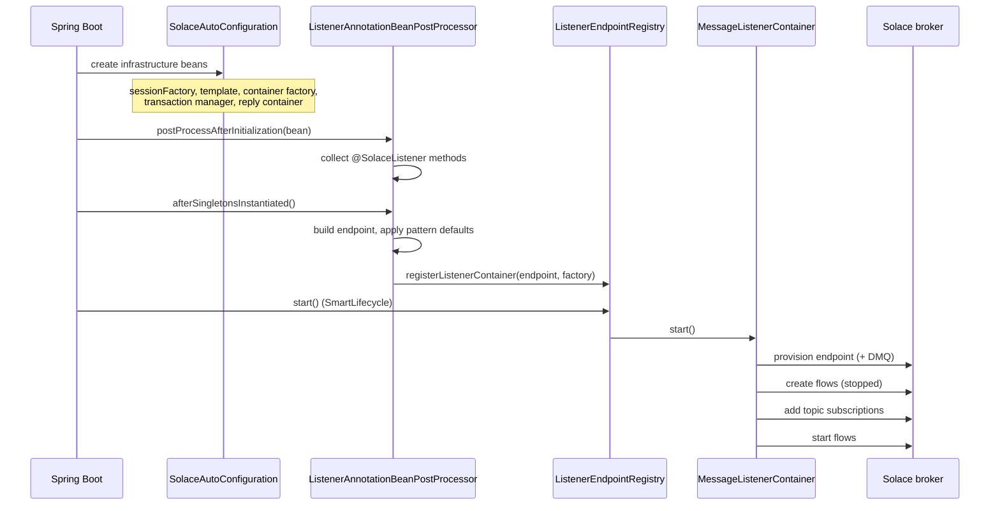

# Architecture

`solace-library` gives Solace PubSub+ the programming model
[Spring for Apache Kafka](https://spring.io/projects/spring-kafka) gives Kafka, built directly on
the Solace [JCSMP](https://docs.solace.com/API/API-Developer-Guide-Java/Java-API-Overview.htm) API.

## Layers

```
┌──────────────────────────────────────────────────────────────────────────┐
│ annotation      @EnableSolace   @SolaceListener                          │
├──────────────────────────────────────────────────────────────────────────┤
│ autoconfigure   SolaceAutoConfiguration · SolaceProperties               │
│                 (outside the application's component-scanned packages)   │
├───────────────────────────────┬──────────────────────────────────────────┤
│ requestreply                  │ listener                                 │
│   ReplyingSolaceTemplate      │   SolaceListenerAnnotationBeanPostProcessor│
│   RequestReplyFuture          │   SolaceListenerEndpointRegistry         │
│                               │   DefaultSolaceListenerContainerFactory  │
│                               │   DefaultSolaceMessageListenerContainer  │
├───────────────────────────────┴──────────────────────────────────────────┤
│ core            SolaceTemplate · SolaceSessionFactory · converters       │
│ transaction     SolaceTransactionManager · SolaceResourceHolder          │
│ support         InstanceIdProvider · ReplyDestinationResolver            │
├──────────────────────────────────────────────────────────────────────────┤
│ JCSMP           JCSMPSession · FlowReceiver · XMLMessageProducer         │
└──────────────────────────────────────────────────────────────────────────┘
```

Nothing in `core` knows about listeners; nothing in `listener` knows about request-reply. The
dependency direction is strictly downward, which is why `SolaceTemplate` can be used on its own in
an application that never declares a listener.

## Correspondence with Spring for Apache Kafka

| Spring for Apache Kafka | This library |
| :--- | :--- |
| `@EnableKafka` | [`@EnableSolace`](annotations.md#enablesolace) |
| `@KafkaListener` | [`@SolaceListener`](annotations.md#solacelistener) |
| `KafkaTemplate` | [`SolaceTemplate`](core.md#solacetemplate) |
| `ReplyingKafkaTemplate` | [`ReplyingSolaceTemplate`](request-reply.md#replyingsolacetemplate) |
| `ProducerFactory` / `ConsumerFactory` | [`SolaceSessionFactory`](core.md#solacesessionfactory) |
| `ConcurrentKafkaListenerContainerFactory` | [`DefaultSolaceListenerContainerFactory`](listener.md#defaultsolacelistenercontainerfactory) |
| `KafkaListenerEndpointRegistry` | [`SolaceListenerEndpointRegistry`](listener.md#solacelistenerendpointregistry) |
| `MessageListenerContainer` | [`SolaceMessageListenerContainer`](listener.md#solacemessagelistenercontainer) |
| `ContainerProperties` | [`ContainerProperties`](listener.md#containerproperties) |
| `ConsumerRecord` | [`SolaceRecord`](core.md#solacerecord) |
| `KafkaTransactionManager` | [`SolaceTransactionManager`](transactions.md#solacetransactionmanager) |
| `RequestReplyFuture` | [`RequestReplyFuture`](request-reply.md#requestreplyfuture) |

## Startup sequence



Two orderings in that diagram are load-bearing:

* **Endpoint before subscription.** A temporary queue does not exist on the broker until a flow
  binds to it, so subscribing first fails with `503 Unknown Queue`.
* **Flows created stopped.** Nothing is delivered in the window between binding and subscribing.

## Message flow, inbound

```
FlowReceiver ─▶ ContainerMessageListener.onReceive
                   │
                   ├── EXECUTOR dispatch ─▶ bounded queue ─▶ FlowInvoker (TaskExecutor thread)
                   │                                              │
                   └── INLINE dispatch ───────────────────────────┤
                                                                  ▼
                                            AbstractSolaceListenerAdapter
                                                  │  convert payload, map headers
                                                  ▼
                                            listener method
                                                  │  return value (optional)
                                                  ▼
                                            SolaceTemplate.send(replyTo, result)
```

## Threading model

| Thread | Created by | Purpose |
| :--- | :--- | :--- |
| `Context_*_ConsumerDispatcher` | JCSMP | delivers messages to `XMLMessageListener` |
| Netty event loop | JCSMP | transport I/O |
| `solace-listener-*` | `solaceListenerTaskExecutor` | listener invocation under `EXECUTOR` dispatch |
| `solace-reply-timeout` | `ReplyingSolaceTemplate` | fails futures whose reply never arrives |
| `solace-keep-alive` | `ContainerKeepAlive` | holds the JVM open for consumer-only applications |

**Every JCSMP thread is a daemon thread.** A listener-only Spring Boot application with no web
server would therefore return from `SpringApplication.run` and shut down with its listeners
perfectly healthy. JCSMP exposes no thread-factory hook (`ContextProperties` carries only a name),
and `Thread.setDaemon` cannot be changed on a running thread, so the library holds the process open
itself — see [`ContainerKeepAlive`](listener.md#containerkeepalive).

## Connections and the transacted-session budget

Solace limits **transacted sessions per client connection** (10 by default). A transactional
container takes one per flow, so several transactional listeners cannot share one connection:
two containers at concurrency 10 and 5 need 15 between them.

| Consumer | Connection |
| :--- | :--- |
| `SolaceTemplate` publishing, non-transactional containers | the shared session |
| each transactional container | its own connection, sized to its own `concurrency` |
| `DIRECT` mode containers | their own connection, so subscriptions stay isolated |
| `SolaceTransactionManager` (`@Transactional`) | the shared session, for the life of each transaction |

The container refuses to start when its `concurrency` exceeds
`solace.listener.max-transacted-sessions-per-connection`, rather than letting the broker reject the
surplus bind.

## Lifecycle phases

| Bean | Phase | Notes |
| :--- | :--- | :--- |
| `SolaceListenerEndpointRegistry` | `Integer.MAX_VALUE - 100` | starts every auto-startup container |
| `DefaultSolaceMessageListenerContainer` | `containerProperties.phase` (same default) | |
| `ReplyingSolaceTemplate` | `Integer.MAX_VALUE - 90` | starts *after* containers, and owns the reply container so no reply can arrive before the correlation map is live |

## Further reading

* [Exchange patterns](exchange-patterns.md) — publish-subscribe, point-to-point, request-reply
* [Transactions](transactions.md)
* [Configuration reference](configuration.md)
* [Troubleshooting](troubleshooting.md)
