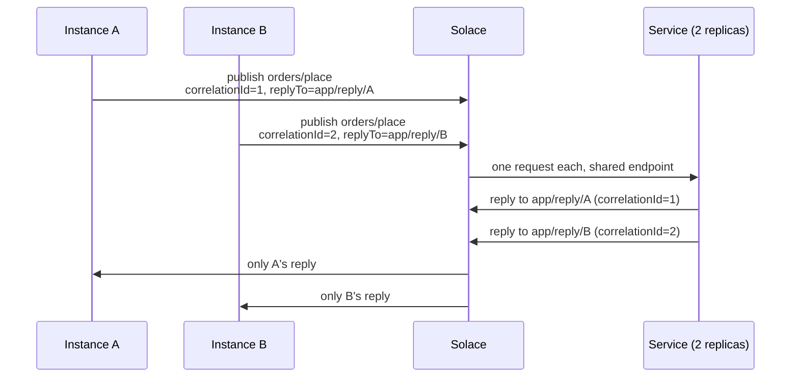

# Exchange patterns

The three [Solace message exchange patterns](https://docs.solace.com/Get-Started/message-exchange-patterns.htm)
are declared on the listener rather than assembled from configuration.

```java
@SolaceListener(pattern = "PUBLISH_SUBSCRIBE", topics = "events/created", queue = "events")
public void onEvent(Event event) { }

@SolaceListener(pattern = "POINT_TO_POINT", topics = "work/submit", queue = "work", group = "workers")
public void onWork(WorkItem item) { }

@SolaceListener(pattern = "REQUEST_REPLY", topics = "orders/place", queue = "orders", group = "svc")
public OrderAck place(Order order) { return ack(order); }   // returned to the requester
```

## Publishing is pattern agnostic

`solace.send(topic, payload)` is identical in all three cases. What decides whether a message fans
out to everyone or goes to exactly one worker is **how the consumers bind** — and that is the entire
job of `pattern`.

| | Who receives a message | Endpoint | Access type | Flows | Scaling out means |
| :--- | :--- | :--- | :--- | :--- | :--- |
| `PUBLISH_SUBSCRIBE` | **every** instance, its own copy | one per instance, `<queue>.<instance-id>`, non-durable | exclusive | 1 | more processing of the same messages |
| `POINT_TO_POINT` | **exactly one** instance | one shared, `<queue>.<group>`, durable | non-exclusive | `concurrency` | more throughput |
| `REQUEST_REPLY` | one instance, which replies | shared request endpoint; reply to the request's `replyTo` | non-exclusive | `concurrency` | more throughput |

The difference between the first two rows is a single decision — whether each instance gets its own
endpoint or they all share one. Naming it once is why the pattern exists: expressed as three
independent flags, the combinations that are wrong outnumber the ones that are right, and a wrong
one fails silently by duplicating work or dropping most of it.

## Defaults each pattern fills in

[`SolaceListenerEndpoint.applyPatternDefaults()`](listener.md#solacelistenerendpoint) sets only what
you left unspecified.

| | `endpointMode` | `appendInstanceIdToQueue` | `accessType` | `concurrency` |
| :--- | :--- | :--- | :--- | :--- |
| `PUBLISH_SUBSCRIBE` | `NON_DURABLE_QUEUE` | `true` | `EXCLUSIVE` | `1` |
| `POINT_TO_POINT` | `DURABLE_QUEUE` | `false` | `NONEXCLUSIVE` | container default |
| `REQUEST_REPLY` | container default | `false` | `NONEXCLUSIVE` | container default |
| *(no pattern)* | container default | container default | container default | container default |

Anything set explicitly wins:

```java
// Durable fan-out: still one endpoint per instance, but it survives restarts.
@SolaceListener(pattern = "PUBLISH_SUBSCRIBE", endpointMode = "DURABLE_QUEUE", topics = "events/created")
```

### Why publish-subscribe pins concurrency to 1

An exclusive endpoint admits a single consumer. Extra flows cannot process anything, and on a
temporary endpoint the broker refuses them outright with `503 Max clients exceeded for queue`.
Parallelism in fan-out comes from running more instances — which is the point of the pattern.

## Topics are shared; endpoints are not

Every instance subscribes to the **same** topic in all three patterns. Only the endpoint name
carries the instance id, and only under `PUBLISH_SUBSCRIBE`:

```
topic     events/created              (identical on every instance)
endpoint  events.instance-a           (instance A)
          events.instance-b           (instance B)
```

`appendInstanceIdToTopics` exists for the separate case where the *topic* should be per-instance —
which is how request-reply routes a reply back to the requester that asked for it.

## Request-reply

The requesting side uses [`ReplyingSolaceTemplate`](request-reply.md), which stamps every request
with a correlation id and a `replyTo` naming this instance's own reply destination. The serving side
is an ordinary `@SolaceListener` whose return value the container publishes to that destination.



No broker-side selector is involved: routing is structural, so it cannot be defeated by a
misconfigured filter.
